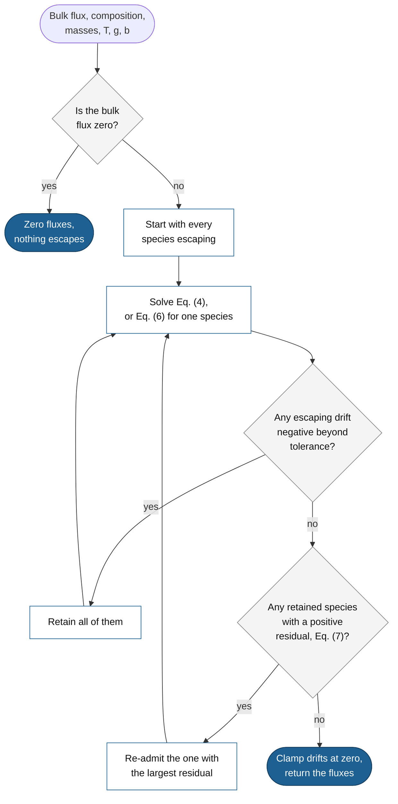

# Fractionation

A hydrodynamic wind does not carry every species equally. Light species stream out; heavier ones are dragged along through collisions, lag the flow, and below a species-specific threshold flux they stop escaping altogether while continuing to exert drag on everything that still escapes. Over time this fractionates the atmosphere, enriching it in heavy species, which is one of the main observable signatures escape leaves behind. When the [regime framework](regimes.md) confirms a hydrodynamic wind, ZEPHYRUS partitions the bulk rate over species with a simultaneous N-species closure (Attia & Lichtenberg 2026 [^attia]); this page describes what the closure solves, where its coefficients come from, which regimes it applies to, and the algorithm the code runs to solve it.

## The problem and the closure

The classic treatment is the two-species problem of Hunten, Pepin & Walker (1987) [^hunten]: a light major species escaping through one heavy species, with a crossover mass separating dragged-along from left-behind. Real atmospheres carry many species at once, and each pair interacts through its own binary diffusion coefficient, so the two-species answer cannot just be applied pairwise. The closure generalizes the constant-composition treatment of the multispecies wind equations of Zahnle, Kasting & Pollack (1990) [^z90] to N species escaping simultaneously.

The solved system couples the species drift velocities. For each escaping species $j$, the drag exerted by every other species balances its weight surplus,

$$\sum_{i\,\mathrm{escaping}} \frac{X_i\,(w_i - w_j)}{b_{ij}} \;-\; w_j \sum_{k\,\mathrm{retained}} \frac{X_k}{b_{jk}} \;=\; \frac{m_j\, g}{k_\mathrm{B} T} - \frac{1}{\bar{H}} \tag{1}$$

where $X_i$ is the mole fraction of species $i$, $w_i$ its drift variable, the number flux the species would carry at unit mole fraction (its number flux is $\Phi_i = X_i w_i$, so $w_i$ is the total number density times the species' bulk velocity at the base), $b_{ij}$ the binary diffusion parameter of the pair, $m_j$ the particle mass, $g$ the gravity at the wind base, $T$ the wind temperature, and $\bar{H}$ the one density scale height that every escaping gas shares, itself an unknown of the solve rather than an input. Retained species carry $w_k = 0$ and appear only through the second sum on the left. The system closes with the mass constraint that the per-species fluxes carry the bulk mass flux $\phi$ the regime framework dispatched,

$$\sum_{j\,\mathrm{escaping}} m_j \Phi_j \;=\; \sum_{j\,\mathrm{escaping}} m_j X_j w_j \;=\; \phi. \tag{2}$$

Which species escape is part of the solution, not an input. A heavy species whose settling under gravity beats the drag the outflow can exert on it drops out of the escaping set and moves to the retained set, where it still appears in the drag sums of Eq. (1). The solver finds the partition into escaping and retained species (on the randomized ensembles of the test suite, enumerating every candidate set finds no other) for which every escaping species has a positive flux and every retained species genuinely cannot be lifted; each heavy species therefore has a threshold bulk flux at which it starts to escape, and below the lowest threshold only the lightest species leaves. The returned per-species rates are non-negative and sum to the bulk rate to rounding precision; [solving the closure](#solving-the-closure) below gives the algorithm step by step.

The closure reproduces, as exact special cases, the published treatments it generalizes: the two-species crossover of Hunten et al. (1987) in the form of Cherubim et al. (2024) [^cherubim], the three-species deuterium system of Gu & Chen (2023) [^guchen], the trace-minor relations of Odert et al. (2018) [^odert] and Zahnle et al. (1990), the non-trace three-species relations of Zahnle & Kasting (2023) [^zk23], and the prescribed-flux partition of Chassefière (1996) [^chassefiere], along with the worked Earth, Mars, and Venus numbers of Hunten et al. (1987). The test suite asserts every one of these reductions, and the general formulation is the subject of Attia & Lichtenberg (2026) [^attia].

## Coefficients and their provenance

Everything species-dependent enters through the binary diffusion parameters $b_{ij}$, and no compilation measures every pair, so each pair carries a provenance class that travels with the result. Measured rows come from the compilations of Zahnle & Kasting (1986) [^zk86] and Zahnle & Kasting (2023) [^zk23], which trace to the reference measurements of Marrero & Mason (1972) [^marrero], with the noble-gas rows of Sasaki & Nakazawa (1988) [^sasaki] verified against them. Pairs no compilation prints are built by the reduced-mass and kinetic-diameter scaling rule of Zahnle & Kasting (2023), validated in and out of sample against the printed entries, and land in a wider uncertainty class. Rock-forming species (Na, Mg, Si, Fe) sit in the widest class of all, and results involving them carry a dedicated flag: no measured coefficient exists for any of their pairs, and sodium and magnesium ionize at the temperatures where rock vapor exists while these are neutral-gas coefficients.

## Where it applies

The closure evaluates at the XUV wind base on the atomized composition (molecules are photodissociated well below the launching level, so the escaping gas is atomic). It applies only where a hydrodynamic branch produced the rate; the other branches split their rates differently:

| Branch that produced the rate | Per-species split |
|---|---|
| `hydrodynamic:EL`, `hydrodynamic:RR`, `hydrodynamic:PL` | The N-species closure at the wind base (this page); with fractionation disabled, reservoir mass fractions |
| `boiloff` | Reservoir mass fractions (no fractionation: the flow is fast and bulk) |
| `hydrostatic` | Natively per-species: each species carries its own Jeans flux and supply cap (see [escape regimes](regimes.md)) |

The split follows the branch and not the label, which matters under `roche_overflow`, where two readings meet. When the geometric screen renamed a bound state, the label left the rate alone and the split is whatever the branch named in `diagnostics['roche']['rate_branch']` produced. When that field reads `roche_overflow` itself, the tidally driven transfer through L1 was dispatched: it is a bulk flow with no per-species physics, so the elements leave in their reservoir proportions and no closure runs.

## Solving the closure

`solve_closure` in `zephyrus.fractionation` solves Eqs. (1) and (2) for a given composition and bulk flux, `solve_fixed_active` solves them on one fixed partition into escaping and retained species, and `closure_per_species` wraps both for the dispatcher. The solver works in cgs units: $\phi$ in g cm$^{-2}$ s$^{-1}$, $m_i$ in g, $g$ in cm s$^{-2}$, $b_{ij}$ in cm$^{-1}$ s$^{-1}$, and $k_\mathrm{B} T$ in erg, so that $w_i$ and $\Phi_i$ come out in cm$^{-2}$ s$^{-1}$ and $\bar{H}^{-1}$ in cm$^{-1}$.

**Inputs and units.** The dispatcher calls `closure_per_species` when a hydrodynamic branch produced the rate, the `fractionate` setting is on, and the rate is positive. It passes the bulk rate $\dot{M}$ (kg s$^{-1}$), the atomized element mole fractions at the wind base, the wind temperature $T$, the planet mass $M_\mathrm{p}$, and the wind-base radius $R_\mathrm{base}$. The wrapper orders the $N$ species by atomic mass, lightest first, renormalizes the mole fractions to $\sum_i X_i = 1$, takes the particle masses $m_i$ from the shared mass table, and evaluates every pair's diffusion parameter at the wind temperature as $b_{ij}(T) = b_{ij}(1000\ \mathrm{K})\,(T / 1000\ \mathrm{K})^{0.75}$, with the 1000 K value from the source order of [coefficients and their provenance](#coefficients-and-their-provenance) and the same exponent for every pair. It then converts the base gravity and the bulk rate to per-area quantities over the full sphere,

$$g = \frac{G M_\mathrm{p}}{R_\mathrm{base}^2}, \qquad \phi = \frac{\dot{M}}{4\pi R_\mathrm{base}^2}. \tag{3}$$

**The linear system on a fixed partition.** Write $\mathcal{A}$ for the escaping (active) set, with $n = |\mathcal{A}|$ members $a_1 < a_2 < \dots < a_n$ in mass order, $\mathcal{R}$ for the retained set, and $\beta_j \equiv m_j g / (k_\mathrm{B} T)$ for the inverse scale height species $j$ would have on its own. The unknowns are the $n$ drift variables of the escaping species and $\bar{H}^{-1}$; retained species have $w_k = 0$ by definition. `solve_fixed_active` assembles Eq. (1) for every escaping species, with $\bar{H}^{-1}$ moved to the left side, and Eq. (2) into one linear system of size $n + 1$,

$$\begin{pmatrix} L_{11} & \cdots & L_{1n} & 1\\ \vdots & \ddots & \vdots & \vdots\\ L_{n1} & \cdots & L_{nn} & 1\\ m_{a_1} X_{a_1} & \cdots & m_{a_n} X_{a_n} & 0 \end{pmatrix} \begin{pmatrix} w_{a_1}\\ \vdots\\ w_{a_n}\\ \bar{H}^{-1} \end{pmatrix} \;=\; \begin{pmatrix} \beta_{a_1}\\ \vdots\\ \beta_{a_n}\\ \phi \end{pmatrix}, \tag{4}$$

with the drag block

$$L_{pq} = \frac{X_{a_q}}{b_{a_p a_q}} \quad (p \neq q), \qquad L_{pp} = -\sum_{q \neq p} \frac{X_{a_q}}{b_{a_p a_q}} \;-\; \sum_{k \in \mathcal{R}} \frac{X_k}{b_{a_p k}}. \tag{5}$$

Row $p$ of Eq. (4) is Eq. (1) for species $a_p$, and the last row is Eq. (2). The retained species enter only through the second sum in $L_{pp}$: they are a static background that drags on every escaping species. The entries of Eq. (4) span more than 20 orders of magnitude (drag coefficients $X/b$ of $10^{-21}$ cm s or less, unit entries in the last column, and products $m X$ near $10^{-24}$ g in the last row), so the matrix is equilibrated on both sides before the solve. With $\mathsf{M}$ the matrix of Eq. (4), $\mathbf{y}$ its right side, $\mathsf{D}_\mathrm{r}$ the diagonal matrix of the inverse row maxima of $|\mathsf{M}|$, and $\mathsf{D}_\mathrm{c}$ the diagonal matrix of the inverse column maxima of $|\mathsf{D}_\mathrm{r} \mathsf{M}|$, the code solves $(\mathsf{D}_\mathrm{r} \mathsf{M} \mathsf{D}_\mathrm{c})\,\mathbf{z} = \mathsf{D}_\mathrm{r}\,\mathbf{y}$ by LU factorization with partial pivoting (`numpy.linalg.solve`) and returns the unknowns as $\mathsf{D}_\mathrm{c}\,\mathbf{z}$. With a single escaping species $j$ the system has a closed-form solution, which the code uses in place of the matrix,

$$w_j = \frac{\phi}{m_j X_j}, \qquad \bar{H}^{-1} = \beta_j + w_j \sum_{k \in \mathcal{R}} \frac{X_k}{b_{jk}}. \tag{6}$$

**The retention inequality.** A retained species $k$ has zero drift, and at the base its density falls with the gradient $d \ln n_k / dr = -\beta_k + \sum_{i \in \mathcal{A}} X_i w_i / b_{ik}$: the drag of the wind supports part of its weight, which is the drag-augmented scale height of Hunten et al. (1987). Staying behind is consistent only if this gradient is at least as steep as the $-\bar{H}^{-1}$ that the escaping gas shares, since otherwise the species' mole fraction would grow with height and the wind would sweep it up. The code evaluates the residual

$$R_k = \sum_{i \in \mathcal{A}} \frac{X_i w_i}{b_{ik}} \;-\; \left(\beta_k - \bar{H}^{-1}\right), \qquad k \in \mathcal{R}, \tag{7}$$

and retention requires $R_k \le 0$. A partition is the solution when both conditions hold at once: $w_j \ge 0$ for every escaping species and $R_k \le 0$ for every retained one. For two species with the lighter one escaping, $R_2 \le 0$ reduces to $m_2 \ge m_\mathrm{c}$, with $m_\mathrm{c} = m_1 + k_\mathrm{B} T\,\Phi_1 / (b_{12}\, g\, X_1)$ the crossover mass of Hunten et al. (1987).

**The iteration.** `solve_closure` runs the following steps.

1. Validate the inputs: $\phi \ge 0$; $X_i \ge 0$ with $|\sum_i X_i - 1| \le 10^{-6}$; $m_i > 0$, $T > 0$, and $g > 0$; every off-diagonal $b_{ij}$ finite and positive; and $b$ symmetric entry by entry. Any failure raises `ValueError`. The diagonal of $b$ is ignored (the coefficient library fills it with infinity).
2. If $\phi = 0$, return zero fluxes, an empty escaping set, and $\bar{H}^{-1} = \min_j \beta_j$, the limit of the solution as $\phi \to 0^+$, where only the lightest species escapes.
3. Start with every species escaping, $\mathcal{A} = \{1, \dots, N\}$, and fix two tolerances: $\varepsilon_w = 10^{-12}\, \phi / \min_i m_i$ for drifts and $\varepsilon_k = 10^{-12}\, \beta_k$ for the residual of species $k$.
4. Solve Eq. (4), or Eq. (6) when $\mathcal{A}$ has one member, for $w$ and $\bar{H}^{-1}$.
5. Drop: if any escaping species has $w_j < -\varepsilon_w$, move all such species to $\mathcal{R}$ at once and return to step 4. If this empties $\mathcal{A}$, raise `RuntimeError`.
6. Re-admit: evaluate Eq. (7) for every retained species. If any has $R_k > \varepsilon_k$, move the one with the largest residual, and only that one, back to $\mathcal{A}$ and return to step 4.
7. Accept: set every escaping drift to $\max(w_j, 0)$, which zeroes negative values smaller in magnitude than $\varepsilon_w$, and return $\Phi_j = X_j w_j$ for escaping species and $\Phi_k = 0$ for retained ones.

Steps 4 to 6 run at most $4N + 8$ times, after which the solver raises `RuntimeError`. Dropping comes before re-admitting, so the residuals of step 6 are only evaluated on a partition whose drifts are all non-negative. Re-admitting a single species per pass, the worst violator, is there to stop the iteration alternating between two labelings of a species that sits at its threshold, where escaping with zero flux and retained with zero residual describe the same state. The code runs no uniqueness check of its own; the test suite enumerates every candidate partition of random systems of three to five species and finds a single one satisfying both conditions, the partition the solver returns.



**Degenerate cases.** Zero flux is handled in step 2; the dispatcher never reaches it, since it calls the closure only on a positive rate. One escaping species is solved by Eq. (6), with no matrix. A species at its own threshold can be returned inside the escaping set with zero flux, and a species with zero mole fraction carries no flux and exerts no drag, so it can end in either set; in both cases the flux, not membership of the escaping set, is the verdict. An emptied escaping set or an exhausted iteration raises `RuntimeError`, and the test suite reaches neither.

**Outputs.** `solve_closure` returns the number fluxes $\Phi_i$ and, on request, $\bar{H}^{-1}$ and the escaping set. `closure_per_species` converts them to per-element mass rates over the full sphere,

$$\dot{M}_i = 4\pi R_\mathrm{base}^2\, m_i\, \Phi_i, \tag{8}$$

in kg s$^{-1}$, and returns them with a diagnostics dictionary, stored as `diagnostics['closure']` in the dispatcher output: `active_set` and `retained` (the two sets, by element), `inv_H_bar_cgs` ($\bar{H}^{-1}$ in cm$^{-1}$), `mass_conservation_rel` (the relative residual $|\sum_i \dot{M}_i - \dot{M}| / \dot{M}$), and `b_provenance` (the source and uncertainty class of every pair). The `rock_former_bij` flag is raised when Na, Mg, Si, or Fe is present. The mass residual is reported and not acted on: no flag or exception depends on it. A further helper, `first_threshold`, returns the bulk flux at which the first heavy species starts to escape. It follows from Eqs. (6) and (7) with only the lightest species $\ell$ escaping and $R_k = 0$,

$$\phi^{*}_{1} = \min_{k \neq \ell}\; \frac{m_\ell X_\ell\, (\beta_k - \beta_\ell)}{X_\ell / b_{\ell k} + \sum_{k' \neq \ell} X_{k'} / b_{\ell k'}}, \tag{9}$$

and the dispatcher does not call it.

**A worked example.** A wind of atomic hydrogen, helium, and oxygen at 8000 K, launched from a base at two Earth radii on a five Earth-mass planet:

```python
import math

import numpy as np

from zephyrus.constants import G, kb_cgs
from zephyrus.diffusion import bmatrix, masses_g
from zephyrus.fractionation import closure_per_species, first_threshold
from zephyrus.planets_parameters import Me, Re

composition = {'H': 0.85, 'He': 0.10, 'O': 0.05}
T, M_p, R_base = 8000.0, 5 * Me, 2 * Re

species = list(composition)
X = np.array([composition[s] for s in species])
m = masses_g(species)
g = G * M_p / R_base**2 * 1e2  # cm s^-2
area = 4 * math.pi * (R_base * 1e2) ** 2  # cm^2
phi_1 = first_threshold(X, m, T, g, bmatrix(species, T))
print(f'first threshold  {phi_1 * area * 1e-3:.3e} kg/s')
print(f'mbar g / kT      {np.sum(X * m) * g / (kb_cgs * T):.4e} cm^-1')

for mdot in (2.0e5, 1.0e6):
    rates, diag, flags = closure_per_species(mdot, composition, T, M_p, R_base)
    print(f'mdot = {mdot:.1e} kg/s')
    print('  escaping', diag['active_set'], ' retained', diag['retained'])
    print('  rates   ', {el: f'{r:.3e}' for el, r in rates.items()})
    print(f"  1/Hbar   {diag['inv_H_bar_cgs']:.4e} cm^-1")
    print(f"  residual {diag['mass_conservation_rel']:.1e}")
```

Output:

```text
first threshold  1.175e+05 kg/s
mbar g / kT      3.7879e-09 cm^-1
mdot = 2.0e+05 kg/s
  escaping ['H', 'He']  retained ['O']
  rates    {'H': '1.745e+05', 'He': '2.552e+04', 'O': '0.000e+00'}
  1/Hbar   3.0980e-09 cm^-1
  residual 1.5e-16
mdot = 1.0e+06 kg/s
  escaping ['H', 'He', 'O']  retained []
  rates    {'H': '5.729e+05', 'He': '2.085e+05', 'O': '2.186e+05'}
  1/Hbar   3.7879e-09 cm^-1
  residual 0.0e+00
```

Helium starts to escape at $1.175 \times 10^{5}$ kg s$^{-1}$. At $2 \times 10^{5}$ kg s$^{-1}$ oxygen is still retained and hydrogen carries 87% of the mass loss; at $10^{6}$ kg s$^{-1}$ all three escape. With every species escaping, weighting Eq. (1) by $X_j$ and summing cancels the drag terms pairwise, because $b$ is symmetric, and leaves $\bar{H}^{-1} = \bar{m} g / (k_\mathrm{B} T)$ with $\bar{m} = \sum_j X_j m_j$; the solver's multiplier at $10^{6}$ kg s$^{-1}$ matches that independent value to the printed digits. With oxygen retained, part of the wind's momentum goes into holding it up, and $\bar{H}^{-1}$ falls below the mean-mass value.

**Where the code departs from the published closures.** The system solved is that of Zahnle et al. (1990) in the subsonic, constant-composition limit; it shares their isothermal and neutral-gas assumptions and, like them, neglects thermal diffusion. The departures, from their treatment and from the two-species limit of Hunten et al. (1987), are these.

- **Prescribed total flux.** Hunten et al. (1987) prescribe the hydrogen flux and Zahnle et al. (1990) the flux of their species 1, and both compute what the heavy species do. Here the bulk mass flux is prescribed by the regime framework, Eq. (2), and every species' flux, the lightest included, is an output, so each entrained heavy species is charged against the budget the light species would otherwise carry. The prescribed-total construction is that of Chassefière (1996), for two species.
- **No designated primary, solved simultaneously.** Zahnle et al. (1990) write the multispecies system for any number of species but solve it only in truncations: at most two major species, minor species as passive test particles with no back-reaction and no coupling to each other, and the limiting flux through two retained heavies only through an approximate harmonic mean (their Eq. 43). The code solves for all $N$ drift variables at once, every pair coupled, with hydrogen given no special role.
- **Pair-specific coefficients, no crossover mass.** Hunten et al. (1987) use one diffusion parameter for every pair, which gives every heavy species the same crossover mass. Here each pair has its own $b_{ij}$, so no single crossover mass exists (as Zahnle et al. 1990 note), and the retention inequality of Eq. (7) replaces the crossover-mass test, reducing to it for two species.
- **A hard zero below threshold.** A retained species carries zero flux. The continuous forms of Zahnle & Kasting (1986, their Eqs. 14 and 16) and of Zahnle et al. (1990, their Eq. 39) keep a small nonzero escape rate at and just below a species' threshold flux, so the code underestimates the fluxes of species close to their thresholds. Hunten et al. (1987) have the same sharp threshold.
- **One level, no radial integration.** The closure is algebra at the wind base. Zahnle et al. (1990) integrate the minor species' composition with height (their Eqs. 37 to 39) and solve the limiting-flux problem as a transonic wind; under constant composition every term of Eq. (1) scales with the same power of radius for co-escaping species, so one level suffices for them, while retained species enter only through their mole fractions at the base.
- **Atoms, not molecules.** Zahnle et al. (1990) work with molecular H$_2$, CO$_2$, and N$_2$; the closure runs on the atomized composition at the wind base (see [where it applies](#where-it-applies)).

---

[^attia]: Attia, M., & Lichtenberg, T. (2026). Atmospheric escape fractionates secondary but not primary atmospheres. *arXiv e-prints*, arXiv:2608.30106. https://doi.org/10.48550/arXiv.2608.30106

[^hunten]: Hunten, D. M., Pepin, R. O., & Walker, J. C. G. (1987). Mass Fractionation in Hydrodynamic Escape. *Icarus, 69*, 532–549.

[^z90]: Zahnle, K., Kasting, J. F., & Pollack, J. B. (1990). Mass Fractionation of Noble Gases in Diffusion-Limited Hydrodynamic Hydrogen Escape. *Icarus, 84*(2), 502–527.

[^zk86]: Zahnle, K. J., & Kasting, J. F. (1986). Mass Fractionation during Transonic Escape and Implications for Loss of Water from Mars and Venus. *Icarus, 68*(3), 462–480.

[^zk23]: Zahnle, K. J., & Kasting, J. F. (2023). Elemental and isotopic fractionation as fossils of water escape from Venus. *Geochimica et Cosmochimica Acta, 361*, 228–244.

[^marrero]: Marrero, T. R., & Mason, E. A. (1972). Gaseous diffusion coefficients. *Journal of Physical and Chemical Reference Data, 1*(1), 3–118.

[^sasaki]: Sasaki, S., & Nakazawa, K. (1988). Origin of isotopic fractionation of terrestrial Xe: hydrodynamic fractionation during escape of the primordial H$_2$-He atmosphere. *Earth and Planetary Science Letters, 89*(3-4), 323–334.

[^cherubim]: Cherubim, C., Wordsworth, R., Hu, R., & Shkolnik, E. (2024). Strong Fractionation of Deuterium and Helium in Sub-Neptune Atmospheres along the Radius Valley. *The Astrophysical Journal, 967*(2), 139. https://doi.org/10.3847/1538-4357/ad3e77

[^guchen]: Gu, P.-G., & Chen, H. (2023). Deuterium Escape on Photoevaporating Sub-Neptunes. *The Astrophysical Journal Letters, 953*(2), L27. https://doi.org/10.3847/2041-8213/acee01

[^odert]: Odert, P., et al. (2018). Escape and fractionation of volatiles and noble gases from Mars-sized planetary embryos and growing protoplanets. *Icarus, 307*, 327–346.

[^chassefiere]: Chassefière, E. (1996). Hydrodynamic Escape of Oxygen from Primitive Atmospheres: Applications to the Cases of Venus and Mars. *Icarus, 124*, 537–552.
