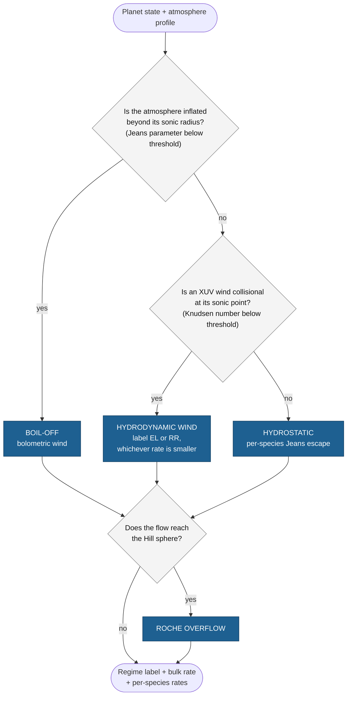

# The ZEPHYRUS model

ZEPHYRUS computes the atmospheric mass loss of rocky and sub-Neptune exoplanets. It runs standalone or as the escape module of the [PROTEUS](https://proteus-framework.org) coupled atmosphere and interior framework, where it is called at every time step with the current planetary state and returns the mass-loss rate that depletes the volatile inventory.

Mass loss happens through two physically distinct channels, and ZEPHYRUS models both:

1. Continuous thermal escape: the steady outflow or evaporation of the upper atmosphere, driven by stellar irradiation and by the planet's own heat. This is one framework with several regimes, described below.
2. Impact-driven erosion: the impulsive removal of atmosphere by a single giant collision during accretion, a separate channel with its own prescription (see [giant impacts](impacts.md)).

## The continuous channel: one framework, five regimes

Which physics carries the continuous loss depends on how tightly the atmosphere is bound, how strongly it is irradiated, and how collisional its outer layers are. Applying a prescription outside its regime gives rates that are wrong by orders of magnitude, so ZEPHYRUS classifies each atmospheric state before choosing a rate. Every state receives one of five regime labels:

- `boiloff`: the atmosphere is so weakly bound that it flows out on the planet's own thermal energy, before stellar XUV heating matters. Typical of young, hot, hydrogen-rich planets fresh out of the nebula.
- `hydrodynamic:EL`: a fluid wind driven by stellar XUV heating, with the rate set by the energy budget (the energy-limited rate is the smaller of the two hydrodynamic limits here).
- `hydrodynamic:RR`: the same fluid wind, but the rate is capped below the energy limit because radiative recombination re-emits part of the absorbed energy (the radiation-recombination-limited rate wins).
- `hydrostatic`: the gas is too rarefied to sustain a fluid wind, and escape proceeds particle by particle from the exosphere (Jeans escape), species by species, capped by how fast diffusion can resupply each species.
- `roche_overflow`: either the tidally driven transfer through the inner Lagrange point (Jackson et al. 2017) outruns every bound candidate and is dispatched as the rate, or the flow region reaches the planet's Hill sphere and the label sits on top of whichever regime produced the rate, which is then a lower limit. `diagnostics['roche']['rate_branch']` says which reading applies.

The classification logic reduces to three questions, asked in a fixed order:

The figure shows the logic, not the full machinery: each branch carries its own rate physics, caps, and consistency checks, and three refinements are omitted for clarity (a thermally unstable exosphere re-routes from the hydrostatic branch back to the wind rate, a residual bolometric rate can be admitted past the boil-off gate by a setting, and the tidally driven L1 transfer rate competes as a final candidate wherever the overflow description applies, taking the overflow label with its own rate when it wins). The [escape regimes](regimes.md) page walks every step with its equations and thresholds.

The regime boundaries are not sharp lines in nature. Each threshold carries a physical band (the collisionality threshold spans a factor of 30 across heating geometries, the boil-off threshold a factor of about two across the literature), and ZEPHYRUS reports, beside every verdict, the diagnostics needed to see how close the state sat to each boundary and what the label would have been at the band edges.

## The default prescription and the full framework

The energy-limited (EL) rate is the default prescription: it is what PROTEUS consumes at each time step today, through the released entry point `zephyrus.escape.EL_escape`, and the [energy-limited escape](energy_limited.md) page defines it in full. It is not an independent channel: within the framework it is one of the two hydrodynamic limits, valid when the atmosphere sustains a collisional XUV-driven wind, which is the regime that dominates the loss during the first 10 to 100 million years of a close-in planet's life.

The full classification framework is available as the standalone entry point `zephyrus.dispatch`, which takes one planetary state (scalars plus an atmosphere profile) and returns the regime label, the bulk rate, per-species rates that sum to it, flags, and the diagnostics container. Its coupling into PROTEUS is planned as a follow-up to the current energy-limited wiring; until then, coupled runs use the EL default and standalone studies can use either entry point.

Whichever regime sets the bulk rate, the loss is also partitioned over chemical species. Confirmed hydrodynamic winds fractionate: heavy species lag the outflow through diffusive drag and can drop out of it entirely, which the N-species closure of the [fractionation](fractionation.md) page resolves (Attia & Lichtenberg 2026, in prep. [^attia]). The other regimes split the rate by reservoir mass fractions, and the hydrostatic regime is natively per-species.

## The impact channel

A giant collision removes part of the target's atmosphere in a single event, on a timescale unrelated to the continuous escape. ZEPHYRUS computes the eroded fraction with the scaling law of Kegerreis et al. (2020) [^kegerreis] through `zephyrus.collision.mass_loss`; the [giant impacts](impacts.md) page defines the law and its fitted domain. The impact channel is not part of the continuous-regime classification: a regime label is reserved for it, and the caller applies impact erosion as a discrete event.

## Reading guide

- [Energy-limited escape](energy_limited.md): the default prescription, its radius scaling, and its tidal correction.
- [Escape regimes](regimes.md): the classification logic and the rate physics of every branch, with thresholds and bands.
- [Dispatching a regime](../Tutorials/dispatch.md): the framework driven end to end on synthetic atmospheres, boundary crossings included.
- [Fractionation](fractionation.md): how a wind partitions over species, and when heavy species drop out.
- [Giant impacts](impacts.md): the erosion scaling law and its fitted domain.
- [Coupling to PROTEUS](proteus.md): configuration keys, the per-time-step sequence, and reservoir bookkeeping.
- [Limitations](limitations.md): what each entry point does not model, and what that implies for results.
- [Troubleshooting the dispatcher](../How-to/troubleshooting.md): what to look at when a flag fires or a label surprises you.
- [Parameter reference](../Reference/parameters.md), [dispatch results](../Reference/results.md), and [API reference](../Reference/api/index.md).

---

[^attia]: Attia, M., & Lichtenberg, T. (2026). In preparation.

[^kegerreis]: Kegerreis, J. A., Eke, V. R., Catling, D. C., Massey, R. J., Teodoro, L. F. A., & Zahnle, K. J. (2020). Atmospheric Erosion by Giant Impacts onto Terrestrial Planets: A Scaling Law for any Speed, Angle, Mass, and Density. *The Astrophysical Journal Letters, 901*(2), L31. https://doi.org/10.3847/2041-8213/abb5fb
