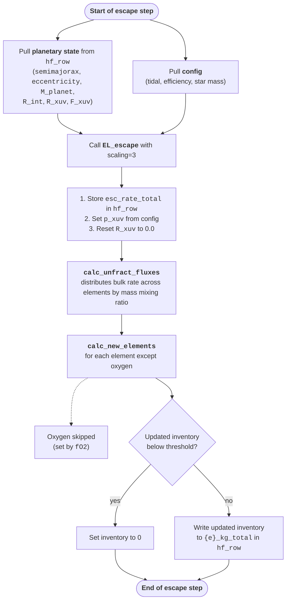

# ZEPHYRUS in PROTEUS

This page describes how ZEPHYRUS is wired into the PROTEUS framework as its atmospheric scape module. The source code for this coupling can be found in the [wrapper](https://github.com/FormingWorlds/PROTEUS/blob/main/src/proteus/escape/wrapper.py). For the underlying ZEPHYRUS model itself, see the [model overview](model.md). For the standalone API, see the [API reference](../Reference/api/index.md).

---

## Selecting an escape module

PROTEUS exposes four escape backends, selected by `config.escape.module`:

| `module` | Behaviour |
|---|---|
| `"none"` | Escape disabled. Bulk rate is set to zero and per-element rates are zeroed. |
| `"dummy"` | Fixed user-specified bulk rate from `config.escape.dummy.rate`. Always unfractionating. |
| `"zephyrus"` | Calls `zephyrus.escape.EL_escape`. Always unfractionating. |
| `"boreas"` | Calls the separate BOREAS module (no longer actively used). |

Any other value raises `ValueError` at the top of `proteus.escape.wrapper.run_escape`.

---

## Configuring the ZEPHYRUS module

The PROTEUS configuration block for ZEPHYRUS lives under `[escape]` and `[escape.zephyrus]` in the input config file:

```toml
[escape]
    module     = "zephyrus"         # Which escape module to use
    reservoir  = "outgas"           # Reservoir that sets escaping composition

    [escape.zephyrus]
        Pxuv        = 5e-5          # Pressure where the atmosphere becomes XUV-opaque [bar]
        efficiency  = 0.1           # Escape efficiency factor (epsilon)
        tidal       = false         # Include tidal correction K_tide?
```

| Key | Type | Units | Description |
|---|---|---|---|
| `escape.module` | str | – | Must be `"zephyrus"` to enable this backend. |
| `escape.reservoir` | str | – | Which volatile inventory the escape rate is distributed over. See [Reservoir](#reservoir) below. |
| `escape.zephyrus.Pxuv` | float | bar | Reference pressure at which the atmosphere is taken to become optically thick to XUV photons; used by the atmosphere module (AGNI/JANUS) to compute the corresponding $R_\mathrm{XUV}$. |
| `escape.zephyrus.efficiency` | float | – | Energy-limited escape efficiency $\epsilon$. |
| `escape.zephyrus.tidal` | bool | – | If `true`, include the tidal correction $K_\mathrm{tide}$ in `EL_escape`. |

!!! note "`scaling=3` is hard-coded"
    The PROTEUS wrapper always calls `EL_escape` with `scaling=3`, i.e. the $R_\mathrm{XUV}^3$ form. This is not exposed as a config option. Standalone users of `EL_escape` can choose `scaling=2` (the function default, $R_p R_\mathrm{XUV}^2$).

---

## At each PROTEUS time step



The wrapper logs the bulk rate and each non-zero elemental rate to the PROTEUS log.

!!! info "fO2"
    Oxygen is excluded from the loss calculation regardless of reservoir: the wrapper preserves it because it is set by the prescribed mantle redox state (`outgas.fO2_shift_IW`).


---

## Reservoir

`config.escape.reservoir` selects which set of inventories defines the elemental mass mixing ratios used to partition the bulk escape rate. The match statement in `calc_new_elements` recognises three values:

| `reservoir` | Description |
|---|---|
| `"bulk"` | Mass mixing ratios computed from whole-planet elemental inventories. |
| `"outgas"` | Mass mixing ratios computed from outgassed atmospheric elemental inventories only. |
| `"pxuv"` | Reserved for fractionation at the XUV-opaque pressure level. Currently raises `ValueError: Fractionation at p_xuv is not yet supported`. |

Any other string raises `ValueError`.

After the loss step, inventories that fall below `config.outgas.mass_thresh` are zeroed out.

---

## Helpfile fields written by ZEPHYRUS

The wrapper writes the following keys into `hf_row` at each step:

| Field | Units | Source |
|---|---|---|
| `esc_rate_total` | kg s$^{-1}$ | Return value of `EL_escape` |
| `esc_rate_{e}` | kg s$^{-1}$ | One per element in `element_list`, set by `calc_unfract_fluxes` |
| `p_xuv` | bar | Copied from `config.escape.zephyrus.Pxuv` |
| `R_xuv` | m | Reset to 0.0; re-populated by the atmosphere module |
| `{e}_kg_total` | kg | Updated by `calc_new_elements` after time-integrating the loss over `dt` |

---

## Termination on atmosphere loss

PROTEUS can be configured to terminate a run when the surface pressure drops below a threshold, regardless of which escape module is in use:

```toml
[params.stop.escape]
    enabled = true
    p_stop  = 5.0       # Stop when surface pressure drops below this value [bar]
```

This works the same way for ZEPHYRUS, dummy, and BOREAS backends.

---

## Giant-impact atmosphere loss

Alongside the continuous escape channel above, ZEPHYRUS provides `collision.mass_loss`, the giant-impact erosion law described in the [model overview](model.md). It is a standalone function of the collision parameters (contact speed, masses, radii, bulk densities, and impact parameter) and returns the fraction of the target's atmosphere removed by one impact, for a caller that models giant impacts during accretion. Three conventions bind the caller: the speed is taken at first contact, the masses and radii exclude the atmosphere with radii at its base, and the densities are bulk values of the atmosphere-free bodies.

---

## Caveats 

!!! warning "Unit handling at the wrapper boundary"
    PROTEUS feeds `EL_escape` stellar mass in **kilograms** directly from `config.star.mass`, which sidesteps the units footgun that standalone callers can hit (see the [first-run tutorial](../Tutorials/first_run.md)). If you bypass the wrapper and call `EL_escape` yourself with PROTEUS-style inputs, replicate this convention.

!!! warning "Fractionation is not supported by ZEPHYRUS"
    ZEPHYRUS is always unfractionating: the bulk rate is partitioned by mass mixing ratio in the chosen reservoir, but light and heavy elements are not preferentially separated in the outflow. This feature will be implemented in the future. 
