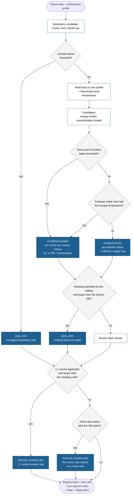

# Escape regimes

This page defines the escape-regime framework behind `zephyrus.dispatch`: the quantities it evaluates, the order it evaluates them in, and the rate physics of every branch. The [model overview](model.md) gives the short version with a flowchart; here every threshold and equation is spelled out. The [energy-limited escape](energy_limited.md) and [fractionation](fractionation.md) pages define the two pieces that have their own pages.

One call takes one planetary state and returns one verdict. The inputs are the planet mass $M_\mathrm{p}$ and interior radius $R_\mathrm{p}$, the stellar mass $M_\star$, the orbit ($a$, $e$), the equilibrium temperature $T_\mathrm{eq}$, the XUV and interior heat fluxes $F_\mathrm{XUV}$ and $F_\mathrm{int}$, the photospheric opacity $\kappa$, and an atmosphere profile (pressure, radius, temperature, composition, and mean molecular mass per level, from the base to the top of the modeled atmosphere). The output is one of the five regime labels, a bulk mass-loss rate, per-species rates that sum to it, flags recording every clamp and fallback, and a diagnostics container that reports how close the state sat to each boundary. Every physically posed input returns a result; exceptions are reserved for malformed input.

## The evaluation order

1. The bolometric (boil-off) candidate is computed at every call. If the restricted Jeans parameter sits below its threshold, the atmosphere is boiling off and that candidate is the rate; XUV-driven escape needs a stable base to launch from, and a bolometrically boiling atmosphere has not built one yet, which is why this test precedes everything else [^owensch].
2. Otherwise the hydrodynamic candidate is assembled: the wind base is located on the profile, a thermostat sets the wind temperature, and the candidate is the smaller of the energy-limited and radiation-recombination-limited rates, with the winner naming the sub-label.
3. The sonic-point Knudsen number decides whether that wind is collisional enough to exist. If it is, the hydrodynamic label stands and the [fractionation closure](fractionation.md) partitions the rate over species; if not, the state re-routes to the hydrostatic branch.
4. The hydrostatic branch evaluates per-species Jeans escape on an extended upper structure. Its stability gate can send a thermally unstable exosphere back to the hydrodynamic rate.
5. Past the activation gate the bolometric candidate is still computed, capped by the interior luminosity, and reported as the residual. It competes for the rate and the label only when the `residual` setting admits it, and by default it does not. The tidally driven transfer through the L1 nozzle [^jackson17] competes last, on both sides of the gate, wherever the overflow description applies; a nozzle win labels the state `roche_overflow` and dispatches the transfer rate itself.
6. Last, the Roche screen tests the active flow radius against the Hill sphere; an overflowing state is renamed `roche_overflow` and keeps the rate its own branch computed. The screen runs after both comparisons, so the radius it tests belongs to the branch that actually won.

Every branch below is one box of that figure, and the two refinements the [model overview](model.md) leaves out of its own flowchart are the diamonds `Q3` and `Q4`: a thermally unstable exosphere returns to the wind rate, and the bolometric residual enters the comparison past the activation gate when the setting admits it.

## Boil-off

A freshly formed or strongly heated planet can hold an atmosphere so distended that its outer layers sit beyond the sonic point of a thermal wind: the gas then flows out on the planet's own thermal energy alone. The activation criterion is the restricted Jeans parameter [^fossati]

$$\Lambda \;=\; \frac{G\,M_\mathrm{p}\,\mu}{k_\mathrm{B}\,T_\mathrm{eq}\,R_\mathrm{p}} \tag{1}$$

the ratio of a particle's gravitational binding energy at the surface to its thermal energy, built with the mean molecular mass $\mu$ of the atmosphere at the photospheric level and the Boltzmann constant $k_\mathrm{B}$. One convention differs from the source: Fossati et al. write their parameter with the atomic hydrogen mass in place of $\mu$, so their $\Lambda$ and this one differ by $\mu / m_\mathrm{H}$ and their numbers cannot be compared with these without that conversion. The composition mean mass is used here because it is what makes the identity below hold, and therefore what makes the threshold one number for every composition instead of one per composition. For isothermal gas $\Lambda = 2 R_\mathrm{B} / R_\mathrm{p}$ identically, where $R_\mathrm{B} = G M_\mathrm{p} / (2 c_\mathrm{s}^2)$ is the sonic (Bondi) radius at isothermal sound speed $c_\mathrm{s}$, so the shutoff Owen & Wu (2016) find at $R_\mathrm{p}/R_\mathrm{B} = 0.1$ is $\Lambda = 20$ for every composition [^owenwu]. That threshold is the default, with the literature spread of 15 to 35 reported as its band; its calibration on hydrogen-rich envelopes is an assumption the diagnostics keep visible.

While $\Lambda < 20$ the state is labeled `boiloff` and the rate is the closed-form transonic Parker wind of Owen & Wu (2016), evaluated at wind temperature $T_\mathrm{eq}/2^{1/4}$ (the recommendation of Misener et al. 2025 for the isothermal formulas [^misener]):

$$\dot{M}_\mathrm{P} \;=\; \frac{4\pi\,G\,M_\mathrm{p}\,\mathcal{M}}{\kappa\,c_\mathrm{s}}, \qquad \mathcal{M} = \sqrt{-W_0\!\left(-x^{-4}\,e^{\,3 - 4/x}\right)}, \quad x = \frac{R_\mathrm{launch}}{R_\mathrm{B}} \tag{2}$$

where $\mathcal{M}$ is the Mach number at the launch level (the photospheric level, radius $R_\mathrm{launch}$), $W_0$ is the principal branch of the Lambert function, and $\kappa$ is the photospheric opacity, which the rate scales inversely with. At $x = 1$ the launch level is sonic and $\mathcal{M} = 1$; for small $x$ the rate shuts off exponentially, which is the physical end of boil-off. The rate is capped by the Bondi-limited supply of Gupta & Schlichting (2020) [^gs20],

$$\dot{M}_\mathrm{B} \;=\; 4\pi R_\mathrm{B}^2\, c_\mathrm{s}\, \rho_\mathrm{launch}\, \exp\!\left(-\frac{G M_\mathrm{p}}{c_\mathrm{s}^2 R_\mathrm{launch}}\right) \tag{3}$$

with $\rho_\mathrm{launch}$ the mass density at the launch level. The cap is evaluated at the same wind temperature as Eq. (2). Gupta & Schlichting write Eq. (3) at $T_\mathrm{eq}$, and Misener et al. (2025) recommend $T_\mathrm{eq}/2^{1/4}$ for that same isothermal form [^misener], so the cap follows the correction rather than the original; the two conventions differ by $2^{-3/8} \exp[\Lambda_\mathrm{launch}(2^{1/4} - 1)]$, with $\Lambda_\mathrm{launch}$ the Jeans parameter at the launch level, a factor near 30 at the shutoff. The choice seldom reaches the rate, because Eqs. (2) and (3) describe one isothermal wind: at a launch level of unit optical depth the cap sits a constant factor of about $e^{3/2}$ below the Parker rate, and on a launch level optically thick to the supplied opacity, which the default 20 mbar level is on an inflated hydrogen envelope, the cap sits above the Parker rate and does not bind. `tau_launch` in the diagnostics says which case a state is in. Past the $\Lambda$ gate the same capping machinery survives, with one cap added: the atmosphere has contracted, so the outflow can no longer draw on the envelope's own inflation and is limited by the heat the interior supplies,

$$\dot{M}_\mathrm{E} \;=\; \frac{L_\mathrm{int}}{g\,R_\mathrm{p}\,K}, \qquad L_\mathrm{int} = 4\pi R_\mathrm{p}^2 F_\mathrm{int} \tag{4}$$

with $g$ the surface gravity and $K$ the tidal reduction factor of Erkaev et al. (2007) [^erkaev] evaluated at $\xi = R_\mathrm{Hill}/R_\mathrm{p}$ [^gs19]. The denominator is the work per unit mass needed to lift gas out of the potential well, which is the same quantity the energy-limited rate on the [energy-limited page](energy_limited.md) divides by, measured from the same radius: a planet close to filling its Roche lobe has a shallower barrier, so the same interior heat lifts more gas, and the two rates that can compete in step 5 measure one barrier between them. Setting `tidal = False` returns $K = 1$ and the untidal form. The rate that survives the gate is therefore $\min(\dot{M}_\mathrm{P}, \dot{M}_\mathrm{B}, \dot{M}_\mathrm{E})$, reported in `diagnostics['bolometric']` on every call as the residual. Whether it also competes is the `residual` setting. Under `'luminosity_capped'` step 5 of the evaluation order compares it against the rate of the branch that won above and the larger one takes both the rate and the label; under the default `'off'` it is reported and the branch verdict stands, and `competes` in the same diagnostics group says which happened.

Whether that residual is physical is disputed, and the default takes the side that dispatches less. Gupta & Schlichting find that a bolometric wind fed by the cooling interior persists for gigayears at the rate of Eq. (4) [^gs19]. Tang et al. (2024) find that once boil-off is initialized self-consistently the same wind removes at most a tenth of a percent of the envelope over gigayears, and diagnose the persistent rate as an artifact of coupling the wind to the core luminosity, of a missing wind energy-loss term, and of pre-boil-off initial conditions [^tang]. The luminosity cap does not make that disagreement small here. In the window just past the gate the Parker and Bondi rates of Eqs. (2) and (3) have not shut off yet, so the residual is Eq. (4) itself: on a three Earth-mass hydrogen envelope with an interior flux of a few watts per square meter it exceeds the XUV rate by more than a decade and would strip a one percent envelope in a few hundred million years, and the closed forms shut off on their own only once the Jeans parameter passes about 30. The default therefore reports the candidate and does not dispatch it, which follows Tang et al.; a run that wants the Gupta & Schlichting reading sets `residual = 'luminosity_capped'`, and the two runs differ by the candidate rate the diagnostics print either way. Their termination timescale is computed and reported beside the rate, never used as a gate, so the reader can see how long the branch would survive under their criterion whichever setting is in force.

## The hydrodynamic wind

Past the boil-off gate, stellar XUV heating can drive a fluid wind. Three pieces are assembled.

**The wind base.** XUV photons deposit their energy where the atmosphere first reaches unit optical depth to them, at the pressure level $P_\mathrm{base} = \mu g / \sigma_{\nu_0}$, with $\sigma_{\nu_0}$ the photoionization cross section at the representative photon energy (the level Lopez 2017 builds the wind on, about a nanobar [^lopez2017]; the cross section follows Murray-Clay et al. 2009 [^mc09]). The base is located on the supplied profile by fixed-point iteration; when the profile is too shallow to reach it, the level clamps to the profile top with the clamp distance recorded, or is evaluated on the extended upper structure (the `extend` option), and either way the choice is flagged.

**The wind temperature.** Rather than assuming the canonical $10^4$ K, a thermostat balances local photoionization heating against radiative cooling at the base. Heating follows the monochromatic-front approximation, $Q_\mathrm{heat} = n_0\, \sigma\, (F_\mathrm{XUV}/h\nu)\,(h\nu - E_\mathrm{ion})$, with $n_0$ the neutral density, $h\nu$ the representative photon energy, and $E_\mathrm{ion}$ the ionization potential. Four cooling channels oppose it: atomic line cooling by H, C, C$^+$, N, N$^+$, O, and O$^+$ in three-level statistical equilibrium (the machinery of Chatterjee & Pierrehumbert 2026 [^cp26] on the atomic data of Nakayama et al. 2022 [^nakayama]), the CO$_2$ 15 micron band and the atomic oxygen fine structure (Johnstone et al. 2018 [^johnstone]; the band is a base-region coolant, evaluated on molecular abundances and on deexcitation rates measured over roughly 150 to 500 K, and it carries a few percent of the budget at the temperatures the thermostat selects against most of it at a 1000 to 3000 K base), and recombination cooling (with the radiative recombination fit of Badnell 2006 [^badnell]). The balance is bracketed between $T_\mathrm{eq}$ and $5 \times 10^4$ K; a balance with no root inside that range clamps to the nearer edge, flagged. A high clamp is the expected outcome at dense bases, where electron densities far above the forbidden-line critical densities quench the line coolants collisionally and the wind runs hot. The upper edge is a validity ceiling rather than an absence of a root: raising it does find one, near $10^5$ K, and that root is outside the model, since the coolants are neutral three-level systems and the gas at that temperature is fully ionized. A clamped temperature is therefore the edge of the bracket and not a solution, and the sonic radius, the recombination-limited rate, and the sonic-point Knudsen number built on it inherit that.

**The two rate limits.** The energy-limited rate is Eq. (1) of the [energy-limited page](energy_limited.md) in the Erkaev form (`scaling=2`, $\xi = R_\mathrm{Hill}/R_\mathrm{p}$), with the efficiency either fixed or taken from the fitted efficiency of Caldiroli et al. (2022) converted to that geometry [^caldiroli]. The radiation-recombination-limited (RR) rate follows the analytic chain of Murray-Clay et al. (2009) [^mc09]: at high flux the base ionization reaches equilibrium between photoionization and recombination, which fixes the base ion density to

$$n_+ \;=\; \sqrt{\frac{F_\mathrm{XUV}\, G M_\mathrm{p}}{h\nu_0\, \alpha_\mathrm{B}\, c_\mathrm{s}^2\, R_\mathrm{base}^2}} \tag{5}$$

with $\alpha_\mathrm{B}$ the case B recombination coefficient of the composition (carrying its $T^{-0.9}$ temperature dependence), $h\nu_0$ the representative ionizing photon energy of the front the composition selects, and $R_\mathrm{base}$ the base radius. The mass density that follows is $\rho_\mathrm{base} = n_+\, \mu_+\, m_\mathrm{p}$, with $\mu_+$ the mean mass per ion of the ionized wind in atomic mass units: electrons counted among the particles and the heavies singly ionized, so the mass per particle is half the mean atomic mass and the mass per ion is the mean atomic mass itself. An isothermal wind then carries that density to the sonic radius $R_\mathrm{s} = G M_\mathrm{p} / (2 c_\mathrm{s}^2)$ with the barometric factor $e^{\,3/2 - \lambda_\mathrm{b}}$, where $\lambda_\mathrm{b} = G M_\mathrm{p} / (R_\mathrm{base} c_\mathrm{s}^2)$ is the Jeans parameter at the base, giving

$$\dot{M}_\mathrm{RR} \;=\; 4\pi\, \rho_\mathrm{s}\, c_\mathrm{s}\, R_\mathrm{s}^2, \qquad \rho_\mathrm{s} = \rho_\mathrm{base}\, e^{\,3/2 - \lambda_\mathrm{b}} \tag{6}$$

The energy in Eq. (5) has been spent ionizing and is re-radiated on recombination, which is why this limit can undercut the energy-limited one. The candidate is $\min(\dot{M}_\mathrm{EL}, \dot{M}_\mathrm{RR})$ and the winner names the sub-label, `hydrodynamic:EL` or `hydrodynamic:RR`. One caution travels with the label: the minimum selects RR through two physically different mechanisms, the recombination-limited base ionization of Eq. (5) setting the rate, or plain barometric suppression at large $\lambda_\mathrm{b}$, where calling the result recombination-limited would be a category error. The quantity that separates them is the barometric factor of Eq. (6), reported beside every rate: near 1 the sonic-point density is the base density and the label means what it says, while several decades below 1 the rate is small because the wind cannot carry material to the sonic point. The flux scaling does not separate them, since the base ion density follows $\sqrt{F_\mathrm{XUV}}$ at every $\lambda_\mathrm{b}$ in this chain. When the computed sonic radius falls below the base, the sonic radius is floored at the base with the base density (no barometric factor below the base) and the state is flagged subcritical. The crossover flux between the two sub-labels is sensitive to the wind temperature the thermostat returns, which enters the RR chain through the sound speed, the barometric exponent, and the recombination coefficient.

## The collisionality switch

A fluid wind only exists if the gas is still collisional where it goes sonic. The switch compares the mean free path against the density scale height at the sonic point, following the construction of Chatterjee & Pierrehumbert (2026), their Eqs. 17 and 18 [^cp26]:

$$\mathrm{Kn}_\mathrm{s} \;=\; \frac{\ell}{H_\mathrm{s}}, \qquad \ell = \frac{1}{\sqrt{2}\,\sigma_\mathrm{C}\, n_\mathrm{s}}, \qquad H_\mathrm{s} = \frac{(1+\gamma)\, R_\mathrm{s}}{4 + \sqrt{2}\sqrt{5 - 3\gamma}} \tag{7}$$

where $\ell$ is the Maxwell mean free path, $n_\mathrm{s}$ the particle density at the sonic point (taken from the isothermal wind of Eq. 6), $\gamma$ the polytropic index (1 for an isothermal wind), and $\sigma_\mathrm{C}$ the density-weighted collision cross section of the mixture. Cross sections come from a provenance-classed fallback order: tabulated collision integrals where they exist (Laricchiuta et al. 2009 [^laricchiuta], validated against measured viscosities), a diffusion-coefficient inversion for hydrogen (Zahnle et al. 1990 [^z90] on the compilation of Zahnle & Kasting 1986 [^zk86]), and a geometric hard sphere as last resort, whose bias is documented and flagged. Six elements have no published van der Waals radius at all (Bondi prints no alkali, alkaline earth, or transition metals), so aluminium, phosphorus, chlorine, potassium, calcium, and titanium reach that fallback on an assumed radius; those carry a provenance class of their own so an assumed number cannot be read as a published one.

One property of the criterion is worth stating plainly, because it is one-sided. The cross sections are neutral-neutral, while the wind can be substantially ionized: the recombination chain reports base ionization fractions reaching 0.86 on heavy compositions. This is the neutral onset, and Chatterjee & Pierrehumbert make the same choice deliberately, noting that collisionality rises with ionization because ion-atom charge exchange and atom-electron collisions carry larger cross sections; they call the neutral criterion reasonable when the flow is advection-dominated and weakly ionized, and highly conservative for characterizing rapid mass loss. Including the ion channels would shorten the mean free path and lower $\mathrm{Kn}_\mathrm{s}$, moving points toward hydrodynamic verdicts, so every hydrostatic call the switch makes on an ionized wind is one the fuller physics could overturn, and no hydrodynamic call is.

A state with $\mathrm{Kn}_\mathrm{s}$ at or below the threshold sustains the wind and keeps the hydrodynamic label; above it, the gas decouples before reaching sonic conditions and the state re-routes to the hydrostatic branch. The default threshold is 1, and its physical band is 0.1 to 3. The two ends come from different arguments. Kinetic simulations place the transition near 0.1 when the heating is deposited in a sharp layer and near 1 when it is distributed (Johnson et al. 2013 [^johnson]), so the lower part of the band is heating-geometry physics rather than tuning freedom. The upper edge is not Johnson's number: Chatterjee & Pierrehumbert (2026) [^cp26] argue the energy limit may survive to a sonic Knudsen number of 1 to 3 or beyond, citing that same work, and call how far it survives an unresolved question. So the band is asymmetric in what supports it, and and the diagnostics report the counterfactual labels at both band edges beside every verdict. For evolutionary use, a supplied previous regime label activates a hysteresis window (factor 1.5) around the threshold so a time-stepping track cannot chatter between branches on numerical noise.

## Hydrostatic escape

Where no wind exists, escape proceeds particle by particle from the exobase, the level where the mean free path first reaches the local scale height. All exobase quantities are evaluated on an extended upper structure: a Bates temperature profile $T(\zeta) = T_\mathrm{exo} - (T_\mathrm{exo} - T_\mathrm{top})\, e^{-\gamma_\mathrm{B} \zeta}$ integrated hydrostatically above the supplied profile top (in $\zeta = \ln(p_\mathrm{top}/p)$, shape parameter $\gamma_\mathrm{B}$; the form Yelle 2024 uses [^yelle]), with the exobase temperature $T_\mathrm{exo}$ prescribed by the caller. Extending the structure is not a refinement but a requirement: the Jeans parameter at the true exobase can differ from its photospheric value by an order of magnitude, and evaluating the escape on photospheric values biases rates toward false retention by up to three orders of magnitude (Johnson et al. 2013 [^johnson]). The prescribed $T_\mathrm{exo}$ (default 1000 K) is the branch's dominant sensitivity, because the rate depends on it exponentially; an optional estimator balances local heating against cooling at the profile top, but a conduction-free local balance is biased high by construction and is deliberately not the default.

Each species $i$ leaves the exobase (radius $R_\mathrm{exo}$, temperature $T_\mathrm{exo}$) with the Jeans effusion velocity

$$w_{\mathrm{J},i} \;=\; \sqrt{\frac{k_\mathrm{B} T_\mathrm{exo}}{2\pi m_i}}\,(1 + \lambda_i)\, e^{-\lambda_i}, \qquad \lambda_i = \frac{G M_\mathrm{p} m_i}{k_\mathrm{B} T_\mathrm{exo}\, R_\mathrm{exo}} \tag{8}$$

where $m_i$ is the particle mass and $\lambda_i$ the species Jeans parameter. The effusion flux is that velocity times the species number density at the exobase, referred back to the anchor radius by the ratio of the two areas, $\Phi_{\mathrm{J},i} = (R_\mathrm{exo}/R_0)^2\, C(\lambda_i)\, w_{\mathrm{J},i}\, X_i\, n_\mathrm{exo}$ (Yelle 2024 Eq. 15), with $X_i$ the diffusively adjusted mixing ratio at the exobase and $R_0$ the profile top the structure was extended from. It carries the kinetic enhancement factor $C(\lambda)$ that direct simulation Monte Carlo runs find above the equilibrium Jeans flux: about 1.7 at $\lambda = 6$, falling to about 1.4 at $\lambda = 15$ (Volkov et al. 2011 [^volkova][^volkovb]), held constant beyond 15 as a flagged extrapolation. The escape of a minor species is additionally capped by how fast diffusion can resupply it through the background gas: the diffusion-limited flux $\Phi_\mathrm{l}$ follows the formulation of Yelle (2024) [^yelle] on binary diffusion coefficients that each carry a provenance class, and the two limits combine as the harmonic mean, $\Phi_i = \Phi_{\mathrm{J},i}\,\Phi_{\mathrm{l},i} / (\Phi_{\mathrm{J},i} + \Phi_{\mathrm{l},i})$, their Eq. 14, which lies below both of its arguments. The dominant species supplies itself and takes the Jeans flux alone.

Two escape temperatures gate the branch's validity. The neutral escape temperature $T_\mathrm{esc} = G M_\mathrm{p} m / (2 k_\mathrm{B} R_\mathrm{exo})$ marks where thermal energy rivals binding energy; the plasma escape temperature is half of it, because in an ionized exosphere the ambipolar electric field shares each ion's binding energy with its electron (Chatterjee & Pierrehumbert 2026, their Eq. 34 [^cp26]). An exobase hotter than half the gating escape temperature cannot remain hydrostatic, and such states re-route to the hydrodynamic rate. Both temperatures are always computed; states where the two conventions disagree are flagged as contested, with both branch rates recorded, because the ion physics that would decide them is not modeled in this version. For the same reason, hydrostatic heavy-element rates are lower limits (the nonthermal channels that dominate heavy-species loss from real exospheres are absent), and every hydrostatic result carries a flag saying so.

## The Roche screen and overflow

Everything above assumes the flow is bound to the planet. Before the label is finalized, the active flow radius of the winning branch (the sonic radius on the boil-off branch, the larger of the XUV and sonic radii on the hydrodynamic branch, the exobase radius on the hydrostatic branch) is tested against the periapsis Hill radius of Eq. (3) on the [energy-limited page](energy_limited.md). A flow that reaches the Hill sphere is spilling over the gravitational boundary rather than escaping through a bound outflow, and the state is named `roche_overflow` for it.

The screen renames a state and never changes its rate. The reason is that the branch whose flow radius gets tested is the one that won the final comparison, so the two sides of the screen's boundary hold the same branch; reporting that branch's own rate keeps the dispatched rate continuous across the boundary, while substituting a different branch's formula would make it jump by orders of magnitude at a line the physics puts nowhere in particular. When the rename fires on a bound branch, the label means the flow reaches the lobe and the rate beside it is the bound-flow estimate, a lower limit on what tides would do.

The tidally driven flow through the inner Lagrange point that a genuinely overflowing planet drives is itself a candidate in the final comparison, from Eq. (3) of Jackson et al. (2017) [^jackson17], in the mass-transfer lineage of Ritter (1988) [^ritter] rebuilt to hold at planetary mass ratios: an isothermal Bernoulli flow from the photosphere to L1, an exponential barrier between the photospheric and L1 potentials from their volume-averaged Roche potential (their Eq. 14) evaluated at the Eggleton (1983) lobe radius [^eggleton], and the elliptical nozzle area that the potential's curvature at L1 admits. Their own reading is what motivates the design. Roche-lobe overflow and evaporative escape are one unbound hydrodynamic outflow seen at two separations. What separates them is whether the photosphere nearly coincides with the lobe.

The candidate is computed at every call and competes wherever the overflow description applies, which is where the isothermal sonic radius $G M_\mathrm{p} / (2 v_\mathrm{th}^2)$ sits at or beyond the L1 distance, so that no spherical transonic wind fits inside the lobe and the nozzle is the flow's constriction. Where that sonic radius sits inside the L1 distance the gas chokes at its own sonic surface first and the wind branches are the description. Their Figure 9 draws the same comparison qualitatively, to ask which of the two pictures a given planet belongs in; turning it into a hard gate on the candidate is this module's sharpening rather than a rule they state. A candidate below the one-proton-per-Julian-year floor does not compete either, since a crossing between two numerically empty numbers would rename the deeply bound corner on no content. That guard is loose: the constant marks what is distinguishable from zero in floating point, so the label remains reachable at rates far below anything that could matter over a planet's lifetime, and `diagnostics['rate_floor']` beside the depletion screen is how a consumer tells.

When the nozzle wins, the label is `roche_overflow`, the rate is the transfer rate itself, and the boundary against the losing branch is continuous by construction. The applicability edge is a criterion boundary like the activation gate, and the jump across it is a result to measure rather than an artifact to hide. The flow carries no energy cap, faithful to the primary, which assumes isothermality and states that assumption as an important limitation rather than a justified one: their Section 3 names the radiative heating and cooling balance along the outflow as the physics they neglect. What the diagnostics report instead is the heat the flow demands, the barrier the rate applied plus the acceleration to the sonic speed, beside the interior luminosity and the intercepted instellation, which is where the assumption shows its strain. That figure describes the candidate rather than the dispatched rate, and comes both duty-cycled and over the full orbit, so a state where the candidate lost still says what the transfer would have cost.

Four conventions travel with the branch. An eccentric orbit is averaged rather than sampled, since the primary treats a circular, synchronously rotating donor and has no eccentric formulation: each phase is evaluated with the circular formula at its own separation and the result averaged in time, duty-cycled over the arc where the overflow description applies. That arc surrounds periapsis, because the L1 distance grows with separation while the sonic radius does not. A secular caller needs the average, and it omits the wind the planet drives on the rest of the orbit; both flags say so. The launch level is the photospheric level, whose Bernoulli invariance makes the level choice cancel along an isothermal column and only along one. Under `nozzle_temperature = 'wind'` the level moves to the wind's own column, anchored at the wind base, so that the density and the sound speed evaluating the barrier still belong to one structure; measured across a factor of four in launch radius the rate holds to half a percent along that column and moves by a factor of eleven along the profile's colder one. On a profile that is neither, which is what a coupled run supplies, the residual is a width rather than a cancellation, measured at a factor of 2.4 across three decades of launch level on a mildly inverted column against 1.14 on an isothermal one.

A launch level at or beyond the lobe clamps the exponential at its lobe-filling boundary value, flagged `nozzle_saturated`, a lower bound on the transfer. Under that clamp the rate goes as the cube of the separation, so periapsis becomes the poorest phase of the orbit rather than the richest. The fourth convention is the launch radius: the profile radius stands in for the volume-equivalent photospheric radius without the primary's Appendix distortion conversion, which their own input chain needs because it starts from a measured transit radius and this one does not. It is worth about 1.6x in rate per percent of radius near contact and nothing well inside the lobe. The temperature evaluating the sound speed and the barrier is the model's dominant uncertainty by its authors' own statement, and the `nozzle_temperature` setting chooses it.

Two things the primary computes and this module does not. The first is the torque-balance transfer rate of their Eq. 24, which needs the stellar tidal dissipation and can sit orders of magnitude below the nozzle rate where disk-stellar torque balance holds; under that reading the dispatched transfer rate is an upper limit. The second is whether the transfer is stable, which couples to orbital evolution that nothing in this package models.

Owen & Jackson (2012) separate two geometries inside that corner [^oj12], and a subflag says which one fired. Dynamical overflow is the atmosphere itself reaching the lobe, tested by comparing the outer extent of the modeled and extended structure, reported as `r_atmosphere` in `diagnostics['roche']`, against the lobe radius in `diagnostics['nozzle']`, and it takes precedence whichever candidate carries the rate. The second case is an atmosphere inside its lobe whose sonic surface would have to sit outside it, so no transonic solution exists; they describe it as a narrow band and hypothesize a subsonic wind out to the lobe. A third subflag value, `neither`, marks a label won by the rate crossing while neither the atmosphere nor the flow radius reaches out. The comparator for the first case is the Roche lobe itself rather than the Hill radius, since the lobe is the critical surface and sits about 0.70 of the way out to it; `r_atmosphere` and `r_lobe` are both reported so the comparison can be read. The distinction is worth reading before a label is trusted, because the flow radius tested on the bolometric branch is a sonic radius that grows with the Jeans parameter: a tightly bound heavy atmosphere can push it several Hill radii out while the atmosphere itself sits deep inside, at a rate with no numerical content. `r_atmosphere` and `diagnostics['rate_floor']` are what separate that case from a real one.

Near misses (a flow radius above two thirds of the Hill radius, so that the Hill radius is less than 1.5 flow radii) raise a `near_roche` flag, because the tidal factor inflates the energy-limited rate steeply there; the flag reports, and never modifies, the rate.

## Boundaries are bands

Every threshold above carries a stated physical width, and the framework reports the width instead of hiding it behind a sharp switch. Beside every verdict, the diagnostics container carries: the counterfactual labels at the Knudsen band edges 0.1 and 3; the boil-off activation band 15 to 35; the transonic energy criterion of Johnson et al. (2013) [^johnson] (can the absorbed power drive the flow sonic at all); the Jeans-parameter triple of Guo (2024) [^guo], which translates the verdict into that taxonomy; both escape temperatures with the local ionization fraction; the tidally corrected critical exobase temperature of Erkaev et al. (2007) [^erkaev]; the fluid condition checked level by level below the sonic radius, after Owen & Jackson (2012) [^oj12]; the threshold-potential screens (the efficiency-collapse band of Caldiroli et al. 2022 [^caldiroli], and the wind-versus-thermosphere screen of Salz et al. 2016 [^salz], whose simulations find energy-limited escape valid below $\log_{10}(-\Phi_\mathrm{G}) = 13.11$ erg g$^{-1}$ and hydrodynamically stable thermospheres above about 13.6, where hydrogen Lyman alpha and free-free emission re-radiate the entire energy input; that grid is hydrogen-dominated, so on a heavy secondary atmosphere the screen is out of its own scope and is reported rather than applied); the boil-off termination timescales of Tang et al. (2024) [^tang]; a snapshot self-consistency screen (would the dispatched rate have destroyed the atmosphere within the system age); and the coefficient provenance class of every species. The container is reporting only: nothing in the dispatch control flow reads it, and it has no off switch.

## Configuration

All knobs, their defaults, and their meanings are tabulated in the [parameter reference](../Reference/parameters.md); the defaults are the documented reference choices used throughout this page. Every field of the result, every flag, and every diagnostics group is tabulated in the [dispatch results reference](../Reference/results.md). The assumptions that remain on every result, whatever the knobs, are collected on the [limitations page](limitations.md).

For the framework in use rather than in principle, the [dispatcher tutorial](../Tutorials/dispatch.md) crosses two of the boundaries above on one planet, measures how far one of them moves across the width of its own criterion, and dispatches an atmosphere along a stellar history; the [troubleshooting guide](../How-to/troubleshooting.md) starts from a flag or an unexpected verdict instead.

---

[^owenwu]: Owen, J. E., & Wu, Y. (2016). Atmospheres of low-mass planets: the "boil-off". *The Astrophysical Journal, 817*(2), 107.

[^owensch]: Owen, J. E., & Schlichting, H. E. (2024). Mapping out the parameter space for photoevaporation and core-powered mass-loss. *Monthly Notices of the Royal Astronomical Society, 528*(2), 1615–1629.

[^fossati]: Fossati, L., et al. (2017). Aeronomical constraints to the minimum mass and maximum radius of hot low-mass planets. *Astronomy & Astrophysics, 598*, A90.

[^misener]: Misener, W., et al. (2025). Blowin' in the Nonisothermal Wind: Core-powered Mass Loss with Hydrodynamic Radiative Transfer. *The Astrophysical Journal, 980*(1), 152.

[^gs19]: Gupta, A., & Schlichting, H. E. (2019). Sculpting the valley in the radius distribution of small exoplanets as a by-product of planet formation: the core-powered mass-loss mechanism. *Monthly Notices of the Royal Astronomical Society, 487*(1), 24–33.

[^gs20]: Gupta, A., & Schlichting, H. E. (2020). Signatures of the core-powered mass-loss mechanism in the exoplanet population: dependence on stellar properties and observational predictions. *Monthly Notices of the Royal Astronomical Society, 493*(1), 792–806.

[^tang]: Tang, Y., et al. (2024). Assessing Core-powered Mass Loss in the Context of Early Boil-off: Minimal Long-lived Mass Loss for the Sub-Neptune Population. *The Astrophysical Journal, 976*(2), 221.

[^mc09]: Murray-Clay, R. A., Chiang, E. I., & Murray, N. (2009). Atmospheric Escape From Hot Jupiters. *The Astrophysical Journal, 693*(1), 23–42. https://doi.org/10.1088/0004-637X/693/1/23

[^lopez2017]: Lopez, E. D. (2017). Born dry in the photoevaporation desert: Kepler's ultra-short-period planets formed water-poor. *Monthly Notices of the Royal Astronomical Society, 472*(1), 245–253.

[^erkaev]: Erkaev, N. V., Kulikov, Y. N., Lammer, H., et al. (2007). Roche lobe effects on the atmospheric loss from "Hot Jupiters". *Astronomy & Astrophysics, 472*(1), 329–334. https://doi.org/10.1051/0004-6361:20066929

[^jackson17]: Jackson, B., Arras, P., Penev, K., Peacock, S., & Marchant, P. (2017). A new model of Roche lobe overflow for short-period gaseous planets and binary stars. *The Astrophysical Journal, 835*(2), 145. https://doi.org/10.3847/1538-4357/835/2/145

[^ritter]: Ritter, H. (1988). Turning on and off mass transfer in cataclysmic binaries. *Astronomy & Astrophysics, 202*, 93.

[^eggleton]: Eggleton, P. P. (1983). Approximations to the radii of Roche lobes. *The Astrophysical Journal, 268*, 368. https://doi.org/10.1086/160960

[^caldiroli]: Caldiroli, A., Haardt, F., Gallo, E., Spinelli, R., Malsky, I., & Rauscher, E. (2022). Irradiation-driven escape of primordial planetary atmospheres II. Evaporation efficiency of sub-Neptunes through hot Jupiters. *Astronomy & Astrophysics, 663*, A122. https://doi.org/10.1051/0004-6361/202142763

[^cp26]: Chatterjee, R. D., & Pierrehumbert, R. T. (2026). Novel Physics of Escaping Secondary Atmospheres May Shape the Cosmic Shoreline. *The Astrophysical Journal, 998*(2), 236. https://doi.org/10.3847/1538-4357/ae2ffa

[^nakayama]: Nakayama, A., Ikoma, M., & Terada, N. (2022). Survival of Terrestrial N$_2$-O$_2$ Atmospheres in Violent XUV Environments through Efficient Atomic Line Radiative Cooling. *The Astrophysical Journal, 937*(2), 72. https://doi.org/10.3847/1538-4357/ac86ca

[^johnstone]: Johnstone, C. P., Güdel, M., Lammer, H., & Kislyakova, K. G. (2018). The Upper Atmospheres of Terrestrial Planets: Carbon Dioxide Cooling and the Earth's Thermospheric Evolution. *Astronomy & Astrophysics, 617*, A107. https://doi.org/10.1051/0004-6361/201832776

[^badnell]: Badnell, N. R. (2006). Radiative recombination data for modelling dynamic finite-density plasmas. *The Astrophysical Journal Supplement Series, 167*, 334. arXiv:astro-ph/0604144.

[^laricchiuta]: Laricchiuta, A., Bruno, D., Capitelli, M., et al. (2009). High temperature Mars atmosphere. Part I: transport cross sections. *The European Physical Journal D, 54*(3), 607–612. https://doi.org/10.1140/epjd/e2009-00192-7

[^z90]: Zahnle, K., Kasting, J. F., & Pollack, J. B. (1990). Mass Fractionation of Noble Gases in Diffusion-Limited Hydrodynamic Hydrogen Escape. *Icarus, 84*(2), 502–527.

[^zk86]: Zahnle, K. J., & Kasting, J. F. (1986). Mass Fractionation during Transonic Escape and Implications for Loss of Water from Mars and Venus. *Icarus, 68*(3), 462–480.

[^johnson]: Johnson, R. E., Volkov, A. N., & Erwin, J. T. (2013). Molecular-Kinetic Simulations of Escape from the Ex-planet and Exoplanets: Criterion for Transonic Flow. *The Astrophysical Journal Letters, 768*(1), L4. https://doi.org/10.1088/2041-8205/768/1/L4

[^volkova]: Volkov, A. N., et al. (2011). Thermally driven atmospheric escape: transition from hydrodynamic to Jeans escape. *The Astrophysical Journal Letters, 729*(2), L24.

[^volkovb]: Volkov, A. N., Tucker, O. J., Erwin, J. T., & Johnson, R. E. (2011). Kinetic simulations of thermal escape from a single component atmosphere. *Physics of Fluids, 23*(6), 066601. https://doi.org/10.1063/1.3592253

[^yelle]: Yelle, R. V. (2024). Diffusion limited escape of hydrogen from Mars. *Icarus, 416*, 116099.

[^guo]: Guo, J. H. (2024). Characterization of the regimes of hydrodynamic escape from low-mass exoplanets. *Nature Astronomy, 8*, 920. https://doi.org/10.1038/s41550-024-02269-w

[^salz]: Salz, M., Schneider, P. C., Czesla, S., & Schmitt, J. H. M. M. (2016). Energy-limited escape revised. The transition from strong planetary winds to stable thermospheres. *Astronomy & Astrophysics, 585*, L2. https://doi.org/10.1051/0004-6361/201527042

[^oj12]: Owen, J. E., & Jackson, A. P. (2012). Planetary evaporation by UV and X-ray radiation: basic hydrodynamics. *Monthly Notices of the Royal Astronomical Society, 425*(4), 2931. https://doi.org/10.1111/j.1365-2966.2012.21481.x
