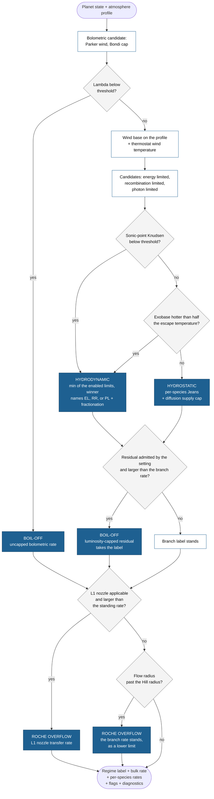

# Escape regimes

This page is the Methods description of `zephyrus.dispatch`: the quantities it evaluates, the order it evaluates them in, and every mass-loss rate it can compute or dispatch, written as the code computes it. The [model overview](model.md) gives the short version with a simpler flowchart. The [fractionation](fractionation.md) page defines the closure that partitions a hydrodynamic rate over species, and the [energy-limited escape](energy_limited.md) page describes the released standalone entry point `EL_escape`, whose physics the dispatcher reuses in the form given in Eq. (11) below.

One call takes one planetary state and returns one verdict. The inputs are the planet mass $M_\mathrm{p}$ and interior radius $R_\mathrm{p}$, the stellar mass $M_\star$, the orbit (semi-major axis $a$, eccentricity $e$), the equilibrium temperature $T_\mathrm{eq}$, the XUV flux at the planet $F_\mathrm{XUV}$, the interior heat flux $F_\mathrm{int}$, the bolometric instellation $F_\mathrm{bol}$, the photospheric opacity $\kappa$, and an atmosphere profile (pressure, radius, temperature, species mixing ratios, and mean molecular mass per level, from the base to the top of the modeled atmosphere). The output is one of six regime labels (`boiloff`, `hydrodynamic:EL`, `hydrodynamic:RR`, `hydrodynamic:PL`, `hydrostatic`, `roche_overflow`), a bulk mass-loss rate $\dot{M}$, per-species rates that sum to it, flags recording every clamp and fallback, and a diagnostics container reporting how close the state sat to each boundary. Every physically posed input returns a result; exceptions are reserved for malformed input.

## Notation

Every rate is a mass-loss rate in kg s⁻¹, written $\dot{M}_\mathrm{X}$ with an upright label naming its physics: $\dot{M}_\mathrm{P}$ (Parker wind), $\dot{M}_\mathrm{B}$ (Bondi cap), $\dot{M}_\mathrm{E}$ (luminosity cap), $\dot{M}_\mathrm{bol}$ (the bolometric candidate), $\dot{M}_\mathrm{EL}$, $\dot{M}_\mathrm{RR}$, and $\dot{M}_\mathrm{PL}$ (energy-limited, radiation-recombination-limited, and photon-limited), $\dot{M}_\mathrm{hyd}$ (the hydrodynamic candidate), $\dot{M}_\mathrm{hs}$ (the hydrostatic rate), and $\dot{M}_\mathrm{L1}$ (the transfer through the inner Lagrange point). Radii are capitalized. Quantities at the sonic point of the XUV wind carry the subscript s (the nozzle's isothermal sonic radius is $R_\mathrm{s,L1}$), the bolometric wind's sonic (Bondi) quantities carry B, and per-species quantities carry the index $i$ (atomized elements the index $j$). $G$ is the gravitational constant, $k_\mathrm{B}$ the Boltzmann constant, and $m_\mathrm{p}$ the proton mass. Units are SI throughout; mean masses written $\mu$ with a level subscript are in kg per particle, while the wind mean masses $\mu_\mathrm{w}$ and $\mu_+$ are in atomic mass units and are multiplied by $m_\mathrm{p}$ where they enter a formula.

Four levels of the atmosphere recur.

- **The photospheric working level** sits at pressure $P_\mathrm{ph}$ (the setting `P_photo`, default 2000 Pa, that is, 20 mbar, the photosphere-type level of Baumeister et al. 2023 [^baumeister]), with radius $R_\mathrm{ph}$, temperature $T_\mathrm{ph}$, mass density $\rho_\mathrm{ph}$, and mean molecular mass $\mu_\mathrm{ph}$, all interpolated linearly in log pressure on the profile (clamped to the nearest end level, flagged `photo_clamped`, when the profile does not span $P_\mathrm{ph}$). This one level is the XUV-absorbing radius of the energy-limited and photon-limited rates, the surface the boil-off activation parameter is evaluated on, the launch level of the Parker wind, and the default launch level of the L1 nozzle. Their published calibrations refer to different surfaces, so sharing one level is a simplification of the model rather than a property of the physics.
- **The wind base**, radius $R_\mathrm{base}$, where the XUV heating is deposited and the hydrodynamic wind is launched (Eq. 9).
- **The profile top**, pressure $P_\mathrm{top}$, radius $R_0$, and temperature $T_\mathrm{top}$, from which the hydrostatic branch extends the structure upward.
- **The exobase**, radius $R_\mathrm{exo}$, located on that extension (Eq. 22).

## The evaluation order

1. The bolometric (boil-off) candidate is computed at every call. If the restricted Jeans parameter sits below its threshold, the atmosphere is boiling off and that candidate is the rate. XUV-driven escape needs a stable base to launch from, and a bolometrically boiling atmosphere has not built one yet, which is why this test precedes everything else [^owensch].
2. Otherwise the hydrodynamic candidate is assembled: the wind base is located on the profile, a thermostat sets the wind temperature, and the candidate is the smallest of the energy-limited, radiation-recombination-limited, and photon-limited rates, with the winner naming the sub-label.
3. The sonic-point Knudsen number decides whether that wind is collisional enough to exist. If it is, the hydrodynamic label stands and the [fractionation closure](fractionation.md) partitions the rate over species; if not, the state re-routes to the hydrostatic branch.
4. The hydrostatic branch evaluates per-species Jeans escape on an extended upper structure, capped by the diffusive supply of each species. Its escape-temperature gate sends a thermally unstable exosphere back to the hydrodynamic rate.
5. Past the activation gate the bolometric candidate is still computed, capped by the interior luminosity, and reported as the residual. It competes for the rate and the label only when the `residual_mode` setting admits it, and by default it does not. The tidally driven transfer through the L1 nozzle [^jackson17] competes last, on both sides of the gate, wherever the overflow description applies; a nozzle win labels the state `roche_overflow` and dispatches the transfer rate itself.
6. Last, the Roche screen tests the flow radius of the winning branch against the Hill radius; an overflowing state is renamed `roche_overflow` and keeps the rate its own branch computed. The screen runs after both comparisons, so the radius it tests belongs to the branch that won.

```mermaid
flowchart TD
    IN(["Planet state + atmosphere profile"]) --> BOLO["Bolometric candidate:<br/>Parker wind, Bondi cap"]
    BOLO --> Q1{"Lambda below<br/>threshold?"}
    Q1 -- yes --> BO["BOIL-OFF<br/>uncapped bolometric rate"]
    Q1 -- no --> BASE["Wind base on the profile<br/>+ thermostat wind temperature"]
    BASE --> HYD["Candidates: energy limited,<br/>recombination limited,<br/>photon limited"]
    HYD --> Q2{"Sonic-point Knudsen<br/>below threshold?"}
    Q2 -- yes --> HD["HYDRODYNAMIC<br/>min of the enabled limits, winner<br/>names EL, RR, or PL + fractionation"]
    Q2 -- no --> Q3{"Exobase hotter than half<br/>the escape temperature?"}
    Q3 -- yes --> HD
    Q3 -- no --> HS["HYDROSTATIC<br/>per-species Jeans<br/>+ diffusion supply cap"]
    BO --> QN
    HD --> Q4{"Residual admitted by the setting<br/>and larger than the branch rate?"}
    HS --> Q4
    Q4 -- yes --> BO2["BOIL-OFF<br/>luminosity-capped residual<br/>takes the label"]
    Q4 -- no --> KEEP["Branch label stands"]
    BO2 --> QN{"L1 nozzle applicable<br/>and larger than<br/>the standing rate?"}
    KEEP --> QN
    QN -- yes --> RN["ROCHE OVERFLOW<br/>L1 nozzle transfer rate"]
    QN -- no --> Q5{"Flow radius<br/>past the Hill radius?"}
    Q5 -- yes --> RO["ROCHE OVERFLOW<br/>the branch rate stands,<br/>as a lower limit"]
    Q5 -- no --> OUT(["Regime label + bulk rate<br/>+ per-species rates<br/>+ flags + diagnostics"])
    RN --> OUT
    RO --> OUT
    classDef regime fill:#1e6091,stroke:#0f3a5c,color:#ffffff
    classDef decision fill:#f4f4f4,stroke:#888888,color:#111111
    classDef stage fill:#ffffff,stroke:#1e6091,color:#111111
    class BO,BO2,HD,HS,RN,RO regime
    class Q1,Q2,Q3,Q4,QN,Q5 decision
    class BOLO,BASE,HYD,KEEP stage
```

Every section below is one box of that figure. The two refinements the [model overview](model.md) leaves out of its own flowchart are the diamonds `Q3` and `Q4`: a thermally unstable exosphere returns to the wind rate, and the bolometric residual enters the comparison past the activation gate when the setting admits it.

## Tidal geometry

Three of the rates below measure a potential barrier, and a close-in planet's barrier is lowered by the star's tidal field. Both the barrier reduction and the Roche screen are built on the Hill radius at periapsis,

$$R_\mathrm{Hill} \;=\; a\,(1 - e)\left(\frac{M_\mathrm{p}}{3\,M_\star}\right)^{1/3} \tag{1}$$

and the barrier reduction is the factor of Erkaev et al. (2007), their Eq. (17) [^erkaev],

$$K(\xi) \;=\; 1 - \frac{3}{2\xi} + \frac{1}{2\xi^3} \;=\; \frac{(\xi - 1)^2\,(2\xi + 1)}{2\xi^3}, \qquad \xi = \frac{R_\mathrm{Hill}}{R_\mathrm{p}} \tag{2}$$

with $\xi$ measured from the interior radius $R_\mathrm{p}$, the radius that appears linearly in the energy-limited rate of Eq. (11) and therefore the one the barrier refers to (the convention of Erkaev et al., whose $\xi$ is the Roche-lobe distance over the planetary radius). $K$ lies in $(0, 1)$ for $\xi > 1$ and rises toward 1 far inside the Hill sphere; the rates divide by it, so tides enhance escape. At $\xi \le 1$ the barrier is gone: the rates are then computed with $K = 1$, flagged `k_tide_undefined`, and the Roche screen relabels the state. Setting `tidal = False` gives $K = 1$ everywhere.

## Boil-off and the bolometric candidate

A freshly formed or strongly heated planet can hold an atmosphere so distended that its outer layers approach the sonic point of a thermal wind; the gas then flows out on the planet's own thermal energy, with the stellar continuum keeping it near isothermal, before XUV heating matters. The activation criterion is the restricted Jeans parameter [^fossati]

$$\Lambda \;=\; \frac{G\,M_\mathrm{p}\,\mu_\mathrm{ph}}{k_\mathrm{B}\,T_\mathrm{eq}\,R_\mathrm{ph}} \tag{3}$$

the ratio of a particle's gravitational binding energy to its thermal energy, evaluated at the photospheric working level with the mean molecular mass there. The photospheric level is the surface the threshold below is calibrated on. In a coupled run $R_\mathrm{p}$ is the interior radius, which on an inflated envelope sits well below the photosphere, and a parameter built there would close the gate while the Parker wind is still running. One convention differs from the source: Fossati et al. write their parameter with the atomic hydrogen mass in place of $\mu_\mathrm{ph}$, so their $\Lambda$ and this one differ by $\mu_\mathrm{ph} / m_\mathrm{H}$, and their numbers cannot be compared with these without that conversion. The composition mean mass is used here because it makes the identity below hold, and therefore makes the threshold one number for every composition instead of one per composition. For isothermal gas at $T_\mathrm{eq}$, $\Lambda = 2 R_\mathrm{B}' / R_\mathrm{ph}$ identically, where $R_\mathrm{B}' = G M_\mathrm{p} \mu_\mathrm{ph} / (2 k_\mathrm{B} T_\mathrm{eq})$ is the Bondi radius at that temperature, so the shutoff Owen & Wu (2016) find with the photosphere at a tenth of the Bondi radius is $\Lambda = 20$ for every composition [^owenwu]. That threshold $\Lambda_\mathrm{c}$ (`lambda_crit`) is the default, with the literature spread of 15 to 35 reported as its band; its calibration on hydrogen-rich envelopes is an assumption the diagnostics keep visible.

The wind itself runs at the temperature Misener et al. (2025) recommend for the isothermal formulas [^misener], cooler than $T_\mathrm{eq}$, which sets its sound speed and sonic radius:

$$T_\mathrm{B} = \frac{T_\mathrm{eq}}{2^{1/4}}, \qquad c_\mathrm{B} = \sqrt{\frac{k_\mathrm{B} T_\mathrm{B}}{\mu_\mathrm{ph}}}, \qquad R_\mathrm{B} = \frac{G M_\mathrm{p}}{2\,c_\mathrm{B}^2} \tag{4}$$

$R_\mathrm{B}$ is larger than $R_\mathrm{B}'$ by $2^{1/4}$, so in the variable $x = R_\mathrm{ph}/R_\mathrm{B}$ of the rates below the gate sits at $x = 2^{3/4} / 20 = 0.084$. While $\Lambda < \Lambda_\mathrm{c}$ the state is labeled `boiloff` and the rate is the closed-form transonic Parker wind of Owen & Wu (2016), their Eq. (6), with the photospheric Mach number in the exact Lambert-function form of their Eq. (7) [^owenwu]:

$$\dot{M}_\mathrm{P} \;=\; \frac{4\pi\,G\,M_\mathrm{p}\,\mathcal{M}}{\kappa\,c_\mathrm{B}}, \qquad \mathcal{M} = \sqrt{-W_0\!\left(-x^{-4}\,e^{\,3 - 4/x}\right)}, \qquad x = \frac{R_\mathrm{ph}}{R_\mathrm{B}} \tag{5}$$

where $\mathcal{M}$ is the Mach number at the launch level and $W_0$ the principal branch of the Lambert function. The rate is $4\pi R_\mathrm{ph}^2 \rho u$ at a launch level of unit optical depth, where the pressure is $g/\kappa$, which is why it scales as $1/\kappa$. At $x = 1$ the launch level is sonic and $\mathcal{M} = 1$; a launch level outside the Bondi radius is clamped to $x = 1$ and flagged `bondi_inflated`. For small $x$ the Mach number, and with it the rate, shuts off exponentially, which is the physical end of boil-off. The exact form is used rather than their small-$x$ asymptote, which absorbs an order-unity prefactor.

The rate is capped by the Bondi-limited supply, in the form of Misener et al. (2025), their Eq. (10) [^misener]:

$$\dot{M}_\mathrm{B} \;=\; 4\pi R_\mathrm{B}^2\, c_\mathrm{B}\, \rho_\mathrm{ph}\, \exp\!\left(2 - \frac{2 R_\mathrm{B}}{R_\mathrm{ph}}\right) \tag{6}$$

the launch density carried hydrostatically to the sonic point and multiplied by the sonic speed over the sonic sphere, at the same wind temperature as Eq. (5), which is the temperature Misener et al. recommend for it. The launch level stands in for their radiative-convective boundary. Gupta & Schlichting (2020), their Eq. (10), write the cap without the factor $e^2$ and at $T_\mathrm{eq}$ [^gs20]; their form is larger than Eq. (6) by $e^{-2}\, 2^{-3/8} \exp[\Lambda (2^{1/4} - 1)]$, a factor of 4.6 at the gate. Against the Parker rate the cap is $\dot{M}_\mathrm{B} / \dot{M}_\mathrm{P} = \tau_\mathrm{ph} (T_\mathrm{B} / T_\mathrm{ph}) \exp(1/2 - \mathcal{M}^2/2)$, with $\tau_\mathrm{ph} = \kappa P_\mathrm{ph} R_\mathrm{ph}^2 / (G M_\mathrm{p})$ the plane-parallel optical depth of the launch level to the supplied opacity. The cap therefore binds only on a launch level optically thin to that opacity, below an optical depth of about 0.6 on a level at the wind temperature. `tau_launch` and `binding_cap` in `diagnostics['bolometric']` say which case a state is in.

Past the gate the same machinery survives with one cap added: the atmosphere has contracted, so the outflow can no longer draw on the envelope's own inflation and is limited by the heat the interior supplies. Dividing the interior luminosity by the work per unit mass needed to lift gas out of the well gives the cap of Gupta & Schlichting (2019), the cooling-luminosity term of their Eq. (8) [^gs19]:

$$\dot{M}_\mathrm{E} \;=\; \frac{L_\mathrm{int}}{g_\mathrm{p}\,R_\mathrm{p}\,K}, \qquad L_\mathrm{int} = 4\pi R_\mathrm{p}^2 F_\mathrm{int}, \qquad g_\mathrm{p} = \frac{G M_\mathrm{p}}{R_\mathrm{p}^2} \tag{7}$$

with $K$ from Eq. (2). The denominator is the same barrier the energy-limited rate of Eq. (11) divides by, measured from the same radius: a planet close to filling its Roche lobe has a shallower barrier, so the same interior heat lifts more gas, and an admitted residual and the XUV rate it competes with measure one barrier between them. The bolometric candidate is the minimum over the caps in force,

$$\dot{M}_\mathrm{bol} \;=\; \begin{cases} \min\left(\dot{M}_\mathrm{P},\ \dot{M}_\mathrm{B}\right), & \Lambda < \Lambda_\mathrm{c} \\ \min\left(\dot{M}_\mathrm{P},\ \dot{M}_\mathrm{B},\ \dot{M}_\mathrm{E}\right), & \Lambda \ge \Lambda_\mathrm{c} \end{cases} \tag{8}$$

reported in `diagnostics['bolometric']` on every call; past the gate it is the residual. Whether the residual also competes is the `residual_mode` setting. Under `'luminosity_capped'` it enters the final comparison of Eq. (38) and the larger rate takes both the rate and the label; under the default `'off'` it is reported and the branch verdict stands, and `competes` in the same diagnostics group says which happened.

Whether that residual is physical is disputed, and the default takes the side that dispatches less. Gupta & Schlichting (2019) find that a bolometric wind fed by the cooling interior persists for gigayears, at the smaller of the Bondi-limited rate and the cooling-luminosity rate of Eq. (7) [^gs19]. Tang et al. (2024) find that once boil-off is initialized self-consistently the same wind removes at most a tenth of a percent of the envelope over gigayears, and diagnose the persistent rate as an artifact of coupling the wind to the core luminosity, of a missing wind energy-loss term, and of pre-boil-off initial conditions [^tang]. Here the dispute is confined to a narrow band past the gate. On a three Earth-mass hydrogen envelope at 0.1 au under an XUV flux of 10 W m⁻², the candidate past the gate is set by the Parker rate of Eq. (5) almost everywhere, since the closed form is still shutting off; it exceeds the XUV rate only while $\Lambda$ stays below about 21 to 23 (lower for a cooler envelope), by up to a factor of about 9 just past the gate between 1000 and 1500 K, and has fallen to 3 to 7% of it at $\Lambda = 25$. The default reports the candidate and does not dispatch it, which follows Tang et al. and makes the gate a jump in the dispatched rate. Measured at the gate itself on a three Earth-mass hydrogen and helium envelope at 1000 K and 0.0775 au, it is a factor of 5.2 under that XUV flux and 518 under 0.1 W m⁻², where the XUV rate is small (3.0 and 303 with `photon_limit = False`). A run that wants the rate continuous across the gate sets `residual_mode = 'luminosity_capped'`, and the two runs differ by the candidate rate the diagnostics print either way. The termination timescale of Tang et al. (their Eq. 8) is computed on the closed-form wind $\min(\dot{M}_\mathrm{P}, \dot{M}_\mathrm{B})$ before the luminosity cap, since that cap and their cooling time are set by the same luminosity, and reported beside the rate, never used as a gate, so the reader can see how long the branch would survive under their criterion whichever setting is in force.

## The hydrodynamic wind

Past the boil-off gate, stellar XUV heating can drive a fluid wind. Its rate is the smallest of three limits built on one wind base and one wind temperature.

**The wind base.** XUV photons deposit their energy where the atmosphere first reaches unit optical depth to them, which over one scale height is the pressure level of Lopez (2017) [^lopez2017],

$$P_\mathrm{base} \;=\; \frac{\mu_\mathrm{base}\, g_\mathrm{base}}{\sigma_{\nu_0,\mathrm{H}}}, \qquad g_\mathrm{base} = \frac{G M_\mathrm{p}}{R_\mathrm{base}^2} \tag{9}$$

about a nanobar, with $\mu_\mathrm{base}$ the profile's mean molecular mass at that level and $\sigma_{\nu_0,\mathrm{H}} = 6 \times 10^{-18} (h\nu_0 / 13.6\ \mathrm{eV})^{-3}$ cm² the hydrogen photoionization cross section of Murray-Clay et al. (2009) at their representative photon energy $h\nu_0 = 20$ eV [^mc09], used for every composition, including those whose thermostat below runs on the nitrogen-like front. Because $\mu_\mathrm{base}$ and $R_\mathrm{base}$ depend on the level the pressure selects, the base is found by fixed-point iteration on the profile. When the profile top is deeper than $P_\mathrm{base}$, the level clamps to the profile top with the clamp distance in pressure decades recorded (`base_clamped`), or, under `base_out_of_range = 'extend'`, is evaluated on the extended upper structure of Eq. (21) (`base_extended`). `base_method` offers a fixed pressure or the BOREAS solver's XUV radius in place of Eq. (9).

**The wind temperature.** Rather than assuming the canonical $10^4$ K, a thermostat balances local photoionization heating against radiative cooling at the base density $n_\mathrm{base}$ and the atomized base composition (element mole fractions $y_j$). Heating follows the monochromatic-front approximation, and the wind temperature $T_\mathrm{w}$ is the root of

$$(1 - f_+)\, n_\mathrm{base}\, \sigma_{\nu_0}\, \frac{F_\mathrm{XUV}}{h\nu_0}\, \left(h\nu_0 - E_\mathrm{ion}\right) \;=\; Q_\mathrm{lines} + Q_{\mathrm{CO_2}} + Q_\mathrm{O} + \tfrac{3}{2}\, k_\mathrm{B} T_\mathrm{w}\, \alpha_\mathrm{rec}(T_\mathrm{w})\, f_+^2\, n_\mathrm{base}^2 \tag{10}$$

where the left side is the photoionization heating rate per unit volume, each ionization leaving $h\nu_0 - E_\mathrm{ion}$ in the gas, with $h\nu_0$ the front's photon energy and $E_\mathrm{ion}$ its ionization potential, $\sigma_{\nu_0}$ its photoionization cross section, and $f_+$ the ionization fraction from local photoionization-recombination balance, $f_+^2 / (1 - f_+) = \sigma_{\nu_0} F_\mathrm{XUV} / (h\nu_0\, \alpha_\mathrm{rec}\, n_\mathrm{base})$. The front follows the composition: the hydrogen front ($h\nu_0 = 20$ eV, $E_\mathrm{ion} = 13.6$ eV, $\sigma_{\nu_0} = \sigma_{\nu_0,\mathrm{H}}$) when the atomized hydrogen fraction is one half or more, the nitrogen-like front of Chatterjee & Pierrehumbert (2026) ($h\nu_0 = 33.6$ eV, $E_\mathrm{ion} = 14.53$ eV, $\sigma_{\nu_0} = 10^{-17}$ cm²) otherwise [^cp26]. Four cooling channels stand on the right. $Q_\mathrm{lines}$ is atomic line cooling by H, C, C$^+$, N, N$^+$, O, and O$^+$ in three-level statistical equilibrium under electron impact, every emitted photon escaping (the machinery of Chatterjee & Pierrehumbert 2026, their Eqs. 26 to 30, on the atomic data of Nakayama et al. 2022 [^nakayama]; the hydrogen system carries Lyman alpha). $Q_{\mathrm{CO_2}}$ is the CO$_2$ 15 micron band and $Q_\mathrm{O}$ the atomic oxygen fine structure at 63 and 147 micron (Johnstone et al. 2018 [^johnstone]); the band is a base-region coolant, evaluated on molecular abundances and on deexcitation rates measured over roughly 150 to 500 K, and it carries a few percent of the budget at the temperatures the thermostat selects against most of it at a 1000 to 3000 K base. The last term is the continuum part of recombination cooling, with $\alpha_\mathrm{rec}$ the radiative recombination fit of Badnell (2006) for nitrogen-dominated gas [^badnell] and the composition-weighted case B coefficient of Eq. (13) otherwise. Each channel has its own setting (`cool_atomic`, `cool_co2_band`, `cool_o_finestructure`, `cool_recombination`), and at least one must stay on.

The balance is scanned upward from $T_\mathrm{eq}$ to $5 \times 10^4$ K and the first downward crossing of heating through cooling is taken, which selects the lowest stable root. A balance with no root inside that range clamps to the nearer edge, flagged. A high clamp is the expected outcome at dense bases, where electron densities far above the forbidden-line critical densities quench the line coolants collisionally and the wind runs hot. The upper edge is a validity ceiling rather than an absence of a root: raising it does find one, near $10^5$ K, and that root is outside the model, since the coolants are neutral three-level systems and the gas at that temperature is fully ionized. A clamped temperature is therefore the edge of the bracket and not a solution, and the sonic radius, the recombination-limited rate, and the sonic-point Knudsen number built on it inherit that. A local balance also misses the temperature structure through the sonic region, which every rate built on $T_\mathrm{w}$ shares.

**The energy-limited rate.** If a fraction $\epsilon$ of the intercepted XUV power goes into lifting gas out of the tidally reduced well, the rate follows from dividing that power by the escape energy per unit mass. The dispatcher uses the form of Erkaev et al. (2007), their Eq. (21) [^erkaev], which is `scaling=2` of `EL_escape`:

$$\dot{M}_\mathrm{EL} \;=\; \frac{\epsilon\,\pi\,F_\mathrm{XUV}\,R_\mathrm{p}\,R_\mathrm{XUV}^2}{G\,M_\mathrm{p}\,K(\xi)}, \qquad R_\mathrm{XUV} = R_\mathrm{ph} \tag{11}$$

with $K$ and $\xi = R_\mathrm{Hill}/R_\mathrm{p}$ from Eq. (2). The absorbing disk $\pi R_\mathrm{XUV}^2$ is taken at the photospheric working level and the barrier $G M_\mathrm{p} K / R_\mathrm{p}$ at the interior radius; the factor $\pi$ encodes full-surface redistribution of the intercepted power, not a dayside cross section. The efficiency $\epsilon$ is the setting `efficiency` (default 0.1) or, under `efficiency_mode = 'caldiroli'`, the fitted evaporation efficiency $\eta$ of Caldiroli et al. (2022, their Appendix A.1) [^caldiroli], which is defined against an $R_\mathrm{p}^3$ geometry and therefore converted to $\epsilon = \eta\, (R_\mathrm{p}/R_\mathrm{XUV})^2$ before use; below the fit's flux bound the fixed efficiency is used instead, flagged.

**The radiation-recombination-limited rate.** At high flux the energy absorbed at the base is spent ionizing and re-radiated on recombination, so the base ionization, not the energy budget, sets the rate. The chain is the analytic one of Murray-Clay et al. (2009), their Section 3.2 [^mc09], generalized to any atomized composition with the mean-mass rule of Lopez (2017) [^lopez2017]: with hydrogen fully ionized, the heavier atoms singly ionized, and the electrons counted among the particles, the wind's mean mass per particle and per ion are

$$\mu_+ = \sum_j y_j A_j, \qquad \mu_\mathrm{w} = \frac{\mu_+}{2}, \qquad c_\mathrm{s} = \sqrt{\frac{k_\mathrm{B} T_\mathrm{w}}{\mu_\mathrm{w} m_\mathrm{p}}}, \qquad R_\mathrm{s} = \frac{G M_\mathrm{p}}{2 c_\mathrm{s}^2}, \qquad \lambda_\mathrm{b} = \frac{G M_\mathrm{p}}{R_\mathrm{base}\, c_\mathrm{s}^2} \tag{12}$$

with $A_j$ the atomic mass of element $j$ in atomic mass units, $c_\mathrm{s}$ the isothermal sound speed of the wind, $R_\mathrm{s}$ its sonic radius, and $\lambda_\mathrm{b}$ the Jeans parameter at the base. The code multiplies by the proton mass where Lopez writes the hydrogen atom mass. The recombination coefficient is the mole-fraction-weighted case B set,

$$\alpha_\mathrm{B}(T_\mathrm{w}) \;=\; \sum_j y_j\, \alpha_{\mathrm{B},j}(10^4\ \mathrm{K}) \left(\frac{T_\mathrm{w}}{10^4\ \mathrm{K}}\right)^{-0.9} \tag{13}$$

with hydrogen's $2.7 \times 10^{-13}$ cm³ s⁻¹ and its $T^{-0.9}$ scaling from Murray-Clay et al. (2009) Eq. (7) [^mc09] and archival values at $10^4$ K for He, C, N, and O, which carry hydrogen's exponent as an approximation (other elements take oxygen's value). Balancing photoionization of the unit-optical-depth neutral column against recombination eliminates the cross section and fixes the base ion density,

$$n_+ \;=\; \sqrt{\frac{F_\mathrm{XUV}\, G M_\mathrm{p}}{h\nu_0\, \alpha_\mathrm{B}\, c_\mathrm{s}^2\, R_\mathrm{base}^2}} \tag{14}$$

with $h\nu_0$ the front energy of Eq. (10). An isothermal Parker wind then carries the base mass density $\rho_\mathrm{base} = n_+\, \mu_+\, m_\mathrm{p}$ to the sonic point, and the rate is the sonic mass flux over the sonic sphere:

$$\dot{M}_\mathrm{RR} \;=\; 4\pi\, \rho_\mathrm{s}\, c_\mathrm{s}\, R_\mathrm{s}^2, \qquad \rho_\mathrm{s} = n_+\, \mu_+\, m_\mathrm{p}\; e^{\,3/2 - \lambda_\mathrm{b}} \tag{15}$$

The barometric factor $e^{\,3/2 - \lambda_\mathrm{b}}$ is the exact isothermal Bernoulli value, including the kinetic energy at the sonic point; the analytic estimate of Murray-Clay et al. omits that term and carries $e^{\,2 - \lambda_\mathrm{b}}$. When the computed sonic radius falls below the base, $R_\mathrm{s}$ is floored at $R_\mathrm{base}$ with $\rho_\mathrm{s} = \rho_\mathrm{base}$ (no barometric factor below the base) and the state is flagged `subcritical_sonic`. The chain inherits the analytic flux exponent of 0.5, where the numerical models of Murray-Clay et al. give 0.6.

**The photon-limited rate.** A third limit counts photons rather than energy. Where recombination is slow and every escaping particle is ionized once, each intercepted ionizing photon removes at most one particle, so no more particles leave per second than photons arrive. This is Eq. (10) of Owen & Alvarez (2016) generalized from pure hydrogen [^owenalvarez], with the photon energy of Eq. (10) and the mass per ion of Eq. (12):

$$\dot{M}_\mathrm{PL} \;=\; \pi R_\mathrm{XUV}^2\, \frac{F_\mathrm{XUV}}{h\nu_0}\, \mu_+ m_\mathrm{p} \tag{16}$$

It is evaluated on the energy-limited rate's own disk, so the two describe one photon budget and their ratio $\dot{M}_\mathrm{EL} / \dot{M}_\mathrm{PL} = \epsilon / \epsilon_\mathrm{PL}$ is free of the absorbing radius, with

$$\epsilon_\mathrm{PL} \;=\; \frac{G M_\mathrm{p}\, K\, \mu_+ m_\mathrm{p}}{h\nu_0\, R_\mathrm{p}} \tag{17}$$

the fraction of a photon's energy that lifting one particle out of the well costs, reported as `efficiency_photon_limit`. The cap binds when the efficiency exceeds it. The fraction is small on shallow wells: 0.034 for a one Earth-mass, 1.05 Earth-radius hydrogen and helium envelope and 0.055 at two Earth masses and 1.3 Earth radii, so at the default efficiency of 0.1 both winds are photon-limited, while a one Earth-mass carbon dioxide atmosphere reaches it at 0.26. The [limitations](limitations.md) page states why the count is an estimate rather than a bound.

**The hydrodynamic candidate.** The three limits combine as

$$\dot{M}_\mathrm{hyd} \;=\; \min\left(\dot{M}_\mathrm{EL},\ \dot{M}_\mathrm{RR},\ \dot{M}_\mathrm{PL}\right) \tag{18}$$

and the winner names the sub-label, `hydrodynamic:EL`, `hydrodynamic:RR`, or `hydrodynamic:PL`. `photon_limit = False` removes $\dot{M}_\mathrm{PL}$ from the minimum and `recombination_limit = False` removes $\dot{M}_\mathrm{RR}$; with both off the wind is the energy-limited rate alone, the configuration most of the literature computes. The recombination chain is still evaluated when its candidate is off, because the collisionality switch below reads its sonic point, so the switch's verdict does not move with that setting.

One caution travels with the RR label: the minimum selects it through two physically different mechanisms, the recombination-limited base ionization of Eq. (14) setting the rate, or plain barometric suppression at large $\lambda_\mathrm{b}$, where calling the result recombination-limited would be a category error. The quantity that separates them is the barometric factor of Eq. (15), reported beside every rate: near 1 the sonic-point density is the base density and the label means what it says, while several decades below 1 the rate is small because the wind cannot carry material to the sonic point. The flux scaling does not separate them, since the base ion density follows $\sqrt{F_\mathrm{XUV}}$ at every $\lambda_\mathrm{b}$ in this chain. The crossover flux between the sub-labels is sensitive to the wind temperature the thermostat returns, which enters the chain through the sound speed, the barometric exponent, and the recombination coefficient.

## The collisionality switch

A fluid wind exists only if the gas is still collisional where it goes sonic. The switch compares the mean free path against the density scale height at the sonic point of Eq. (12), following Chatterjee & Pierrehumbert (2026), their Eqs. (17) and (18) [^cp26]:

$$\mathrm{Kn}_\mathrm{s} \;=\; \frac{\ell_\mathrm{s}}{H_\mathrm{s}}, \qquad \ell_\mathrm{s} = \frac{1}{\sqrt{2}\,\sigma_\mathrm{C}\, n_\mathrm{s}}, \qquad H_\mathrm{s} = \frac{(1+\gamma)\, R_\mathrm{s}}{4 + \sqrt{2}\sqrt{5 - 3\gamma}}, \qquad n_\mathrm{s} = \frac{\rho_\mathrm{s}}{\mu_+ m_\mathrm{p}} \tag{19}$$

where $\ell_\mathrm{s}$ is the Maxwell mean free path, $n_\mathrm{s}$ the heavy-particle density at the sonic point from Eq. (15), $\gamma$ the polytropic index (`gamma_wind`, 1 for an isothermal wind), and $\sigma_\mathrm{C}$ the density-weighted collision cross section of the atomized mixture at $T_\mathrm{w}$, their Eq. (25),

$$\sigma_\mathrm{C} \;=\; \sum_j y_j\, \sigma_j(T_\mathrm{w}) \tag{20}$$

Cross sections come from a provenance-classed fallback order: tabulated collision integrals where they exist, as the momentum-transfer cross section $\pi \sigma^2 \Omega^{(1,1)*}$ (Laricchiuta et al. 2009, their Eqs. 2 to 4 [^laricchiuta], validated against measured viscosities), a diffusion-coefficient inversion for hydrogen (Zahnle et al. 1990, their Eq. 30 [^z90], on the compilation of Zahnle & Kasting 1986 [^zk86]), and a geometric hard sphere as last resort, whose bias is documented and flagged. Six elements carry no radius in the package's table, so aluminium, phosphorus, chlorine, potassium, calcium, and titanium reach that fallback on an assumed radius; those carry a provenance class of their own so an assumed number cannot be read as a published one. For two of them the gap is in the source: Bondi (1964) [^bondi] gives no radius for aluminium or calcium, among the 16 of 44 main-group elements missing from that table, which Mantina et al. (2009) later supplied on the same scale [^mantina]. Phosphorus, chlorine, and potassium are main-group elements Bondi does tabulate, and titanium is a transition metal; the table does not carry them yet.

One property of the criterion is one-sided. The cross sections are neutral-neutral, while the wind can be substantially ionized: the recombination chain reports base ionization fractions reaching 0.86 on heavy compositions. This is the neutral onset, and Chatterjee & Pierrehumbert make the same choice deliberately, noting that collisionality rises with ionization because ion-atom charge exchange and atom-electron collisions carry larger cross sections; they call the neutral criterion reasonable when the flow is advection-dominated and weakly ionized, and highly conservative for characterizing rapid mass loss. Including the ion channels would shorten the mean free path and lower $\mathrm{Kn}_\mathrm{s}$, moving points toward hydrodynamic verdicts, so every hydrostatic call the switch makes on an ionized wind is one the fuller physics could overturn, and no hydrodynamic call is.

A state with $\mathrm{Kn}_\mathrm{s}$ at or below the threshold $\mathrm{Kn}_\mathrm{c}$ (`kn_crit`) sustains the wind and keeps the hydrodynamic label; above it, the gas decouples before reaching sonic conditions and the state re-routes to the hydrostatic branch. The default threshold is 1, and its physical band is 0.1 to 3. The two ends come from different arguments. Kinetic simulations place the transition near 0.1 when the heating is deposited in a sharp layer and near 1 when it is distributed (Johnson et al. 2013 [^johnson]), so the lower part of the band is heating-geometry physics rather than tuning freedom. The upper edge is not Johnson's number: Chatterjee & Pierrehumbert (2026) [^cp26] argue the energy limit may survive to a sonic Knudsen number of 1 to 3 or beyond, citing that same work, and call how far it survives an unresolved question. The band is therefore asymmetric in what supports it, and the diagnostics report the counterfactual labels at both band edges beside every verdict. For evolutionary use, a supplied previous regime label activates a hysteresis window: the threshold becomes $h\,\mathrm{Kn}_\mathrm{c}$ while leaving a hydrodynamic state and $\mathrm{Kn}_\mathrm{c}/h$ while leaving a hydrostatic one, with $h$ = `kn_hysteresis` (default 1.5), so a time-stepping track cannot chatter between branches on numerical noise.

## Hydrostatic escape

Where no wind exists, escape proceeds particle by particle from the exobase, the level where the mean free path first reaches the local scale height, and each species escapes at the smaller of two bottlenecks: how fast it effuses from the exobase and how fast diffusion resupplies it from below.

**The upper structure.** All exobase quantities are evaluated on an extended upper structure built above the profile top, with composition and mean molecular mass $\mu_0$ frozen at their values there. The temperature follows the Bates profile in the form Yelle (2024) uses, their Eq. (19) [^yelle], and the radius follows from hydrostatic balance, both in the log-pressure coordinate $\zeta = \ln(P_\mathrm{top}/P)$:

$$T(\zeta) \;=\; T_\infty - \left(T_\infty - T_\mathrm{top}\right) e^{-\gamma_\mathrm{B} \zeta}, \qquad \frac{\mathrm{d}r}{\mathrm{d}\zeta} = \frac{k_\mathrm{B}\, T\, r^2}{G M_\mathrm{p}\, \mu_0}, \qquad n = \frac{P_\mathrm{top}\, e^{-\zeta}}{k_\mathrm{B} T} \tag{21}$$

with $r(0) = R_0$, the shape parameter $\gamma_\mathrm{B}$ (`gamma_bates`, default 0.75), and the exospheric temperature $T_\infty$ that the profile approaches (`T_exo_value`, default 1000 K). The integration stops, flagged `extension_unbound`, where the local Jeans parameter falls below 2, since the structure is unbound beyond that point. The exobase is the first level of this structure where

$$\frac{1}{\sqrt{2}\,\sigma_\mathrm{C}\, n} \;\ge\; \frac{k_\mathrm{B}\, T\, r^2}{G M_\mathrm{p}\, \mu_0} \tag{22}$$

with $\sigma_\mathrm{C}$ the mixture cross section of Eq. (20), taken over the anchor species at the local temperature, which defines $R_\mathrm{exo}$, $n_\mathrm{exo}$, and $T_\mathrm{exo} = T(R_\mathrm{exo})$. Extending the structure is a requirement and not a refinement: the Jeans parameter at the true exobase can differ from its photospheric value by an order of magnitude, and evaluating the escape on photospheric values biases rates toward false retention by up to three orders of magnitude (Johnson et al. 2013 [^johnson]). The prescribed $T_\infty$ is the branch's dominant sensitivity, because the rate depends on it exponentially. A value below $T_\mathrm{top}$ would build a thermosphere cooling with height, whose exobase is more strongly bound than its anchor, so it floors at $T_\mathrm{top}$, flagged. An optional estimator (`T_exo_mode = 'thermostat'`) solves the balance of Eq. (10) at the profile top instead, but a conduction-free local balance is biased high by construction and is deliberately not the default.

**Jeans effusion.** Each species $i$, of particle mass $m_i$, leaves the exobase with the Jeans effusion velocity of Yelle (2024), their Eqs. (20) and (21) [^yelle],

$$w_{\mathrm{J},i} \;=\; \sqrt{\frac{k_\mathrm{B} T_\mathrm{exo}}{2\pi m_i}}\,(1 + \lambda_i)\, e^{-\lambda_i}, \qquad \lambda_i = \frac{G M_\mathrm{p}\, m_i}{k_\mathrm{B}\, T_\mathrm{exo}\, R_\mathrm{exo}} \tag{23}$$

where $\lambda_i$ is the species Jeans parameter. Direct simulation Monte Carlo runs find the actual escape rate above the equilibrium Jeans rate, because collisions above the exobase and a non-Maxwellian exobase distribution feed the escaping tail: about 1.7 times at $\lambda = 6$, falling to about 1.4 at $\lambda = 15$ (Volkov et al. 2011 [^volkova][^volkovb]). The code interpolates that factor linearly,

$$C(\lambda) \;=\; \begin{cases} 1.7, & \lambda \le 6 \\ 1.7 - 0.3\,(\lambda - 6)/9, & 6 < \lambda < 15 \\ 1.4, & \lambda \ge 15 \end{cases} \tag{24}$$

holding the endpoint values outside the simulated range as a flagged extrapolation (`volkov_extrapolated`); below $\lambda = 6$ the held value likely understates the flux, and trace light species on a heavy background reach that side. The effusion flux, referred to the anchor sphere of radius $R_0$ (Yelle 2024, their Eq. 15), is

$$\tilde{\Phi}_{\mathrm{J},i} \;=\; \left(\frac{R_\mathrm{exo}}{R_0}\right)^2 C(\lambda_i)\; w_{\mathrm{J},i}\; \tilde{X}_i(\zeta_\mathrm{exo})\; n_\mathrm{exo} \tag{25}$$

with $\tilde{X}_i(\zeta_\mathrm{exo})$ the diffusive-equilibrium mole fraction at the exobase from Eq. (26).

**Diffusive supply.** Below the exobase each species diffuses through the frozen background with molecular diffusion coefficient $D_i = b_i / n$ and eddy diffusion coefficient $K_{zz}$ (the profile's top value, or `kzz`, default 300 m² s⁻¹). The mixture diffusion parameter follows Blanc's law, $b_i = (1 - X_i) / \sum_{k \ne i} (X_k / b_{ik})$, over binary parameters $b_{ik}$ that each carry a provenance class, and thermal diffusion enters through an effective mass, Yelle (2024) Eq. (4), with the thermal diffusion factor $\alpha_\mathrm{T} = -0.25$ that Yelle adopts for light species. The zero-flux mole fraction, their Eq. (9), is

$$\tilde{X}_i(\zeta) \;=\; X_i(0)\, \exp\!\left[\int_0^{\zeta} \left(1 - \frac{\tilde{m}_i}{\mu_0}\right) \frac{D_i}{D_i + K_{zz}}\, \mathrm{d}\zeta'\right], \qquad \tilde{m}_i = m_i + \alpha_\mathrm{T}\, \mu_0\, \frac{\mathrm{d}\ln T}{\mathrm{d}\zeta} \tag{26}$$

with $X_i(0)$ the species mole fraction at the profile top, and the limiting flux of their Eqs. (10) and (11), the largest flux diffusion can deliver to the exobase, is

$$\Phi_{\mathrm{l},i} \;=\; \left[\int_0^{\zeta_\mathrm{exo}} \frac{k_\mathrm{B}\, T\, R_0^2}{G M_\mathrm{p}\, \mu_0\, \tilde{X}_i\, n\, (D_i + K_{zz})}\, \mathrm{d}\zeta\right]^{-1} \tag{27}$$

Both integrals are first order in the log-pressure step, so the quadrature grid is doubled from `hydrostatic_levels_min` until the bulk rate changes by less than `hydrostatic_rtol` (default 1%) or `hydrostatic_levels_max` is reached, and the levels used and the last change travel in the diagnostics; the finest grid's values are returned, never an extrapolation.

**The combined rate.** The two bottlenecks combine by the harmonic mean of Yelle (2024), their Eq. (14) [^yelle], which lies below both of its arguments and tends to the smaller one:

$$\Phi_i \;=\; \frac{\tilde{\Phi}_{\mathrm{J},i}\; \Phi_{\mathrm{l},i}}{\tilde{\Phi}_{\mathrm{J},i} + \Phi_{\mathrm{l},i}} \tag{28}$$

The most abundant species at the anchor supplies itself: it takes $\tilde{X}_i = X_i(0)$ and the Jeans flux alone, $\Phi_i = \tilde{\Phi}_{\mathrm{J},i}$. So does any species whose supply-free rate already falls below the one-proton-per-Julian-year floor, since the harmonic mean could only be smaller. Every flux is per unit area of the anchor sphere, so the hydrostatic rate is

$$\dot{M}_\mathrm{hs} \;=\; \sum_i 4\pi R_0^2\, m_i\, \Phi_i \tag{29}$$

with each species rate mapped onto elements by the mass fractions of its formula. Hydrostatic heavy-element rates are lower limits, since the nonthermal channels that dominate heavy-species loss from real exospheres (ion pickup, photochemical escape, sputtering) are absent, and every hydrostatic result carries the `hydrostatic_lower_limit` flag.

**The escape-temperature gate.** Two escape temperatures decide whether the exobase can stay hydrostatic at all:

$$T_\mathrm{esc} \;=\; \frac{G M_\mathrm{p}\, \mu_0}{2\, k_\mathrm{B}\, R_\mathrm{exo}}, \qquad T_\mathrm{esc,+} = \frac{T_\mathrm{esc}}{2} \tag{30}$$

The neutral escape temperature $T_\mathrm{esc}$ marks where thermal energy rivals binding energy; the plasma escape temperature $T_\mathrm{esc,+}$ is half of it, because in an ionized exosphere the ambipolar electric field shares each ion's binding energy with its electron (Chatterjee & Pierrehumbert 2026, their Eq. 34 [^cp26]). An exobase with $T_\mathrm{exo}$ above half the gating escape temperature is unstable by their Figure 10 criterion, and such states re-route to the hydrodynamic rate of Eq. (18), flagged `gate_rerouted`. The setting `gate` chooses the neutral (default) or the plasma temperature. Both are always computed, together with the local ionization fraction at the exobase; states where the two conventions disagree are flagged `contested_ion`, with both branch rates recorded, because the ion physics that would decide them is not modeled.

## Tidal transfer through L1

The tidally driven flow through the inner Lagrange point that a genuinely overflowing planet drives is a candidate in the final comparison, from Jackson et al. (2017) [^jackson17], in the mass-transfer lineage of Ritter (1988) [^ritter] rebuilt to hold at planetary mass ratios. Their reading motivates the design: Roche-lobe overflow and evaporative escape are one unbound hydrodynamic outflow seen at two separations, and what separates them is whether the photosphere nearly coincides with the lobe.

The flow is isothermal at the launch level's temperature $T_\mathrm{launch}$ and mean particle mass $\mu_\mathrm{launch}$. Under the default `nozzle_temperature = 'photospheric'` the launch level is the photospheric working level, $(R_\mathrm{launch}, \rho_\mathrm{launch}, T_\mathrm{launch}, \mu_\mathrm{launch}) = (R_\mathrm{ph}, \rho_\mathrm{ph}, T_\mathrm{ph}, \mu_\mathrm{ph})$, the construction of the primary; under `'wind'` it is the wind base at the wind's own temperature and mean mass, $(R_\mathrm{base},\ P_\mathrm{base}\, \mu_\mathrm{w} m_\mathrm{p} / (k_\mathrm{B} T_\mathrm{w}),\ T_\mathrm{w},\ \mu_\mathrm{w} m_\mathrm{p})$. At an orbital separation $d$, with mass ratio $q = M_\mathrm{p}/M_\star$,

$$v_\mathrm{th} = \sqrt{\frac{k_\mathrm{B} T_\mathrm{launch}}{\mu_\mathrm{launch}}}, \qquad \Omega^2 = \frac{G (M_\mathrm{p} + M_\star)}{d^3}, \qquad A(q) = 4 + \frac{b_1}{b_2 + q^{1/3} + q^{-1/3}} \tag{31}$$

where $v_\mathrm{th}$ is the isothermal sound speed, $\Omega$ the orbital frequency, and $A$ the dimensionless curvature of the potential at L1 in the fit of their Eq. (10), with $b_1 = 2 \cdot 3^{2/3}$ and $b_2 = b_1/4 - 2$, accurate to 0.3% for all mass ratios. The lobe is the Eggleton (1983) volume-equivalent radius as printed in their Section 2.1 [^eggleton],

$$R_\mathrm{lobe} \;=\; d\, \frac{0.49\, q^{2/3}}{0.6\, q^{2/3} + \ln(1 + q^{1/3})} \tag{32}$$

and the barrier is taken between two values of their volume-averaged Roche potential, their Eq. (14), written $\Psi$ here to keep it apart from the fluxes above (they write $\Phi$):

$$\Psi(r) \;=\; -\left(\frac{G M_\star}{d} + \frac{G M_\star^2}{2 d (M_\mathrm{p} + M_\star)}\right) - \frac{G M_\mathrm{p}}{r}\left[1 + \frac{M_\mathrm{p} + M_\star}{3 M_\mathrm{p}} \left(\frac{r}{d}\right)^3 + \frac{4}{45}\, \frac{(M_\mathrm{p} + M_\star)^2 + 9 M_\star^2 + 3 M_\star (M_\mathrm{p} + M_\star)}{M_\mathrm{p}^2} \left(\frac{r}{d}\right)^6\right] \tag{33}$$

the potential of the equipotential enclosing the volume of a sphere of radius $r$, with $\Psi_\mathrm{L1} = \Psi(R_\mathrm{lobe})$ and $\Psi_\mathrm{launch} = \Psi(R_\mathrm{launch})$. A Bernoulli integral from the launch level, where the flow is slow, to L1, where it is sonic, gives the density at L1 (their Eqs. 11 to 13, the source of the factor $e^{-1/2}$), and the gas crosses the elliptical nozzle that the curvature at L1 admits (their Eqs. 8 and 9) at the sound speed. The transfer rate is their Eq. (3):

$$\dot{M}_\mathrm{L1}(d) \;=\; e^{-1/2}\, \rho_\mathrm{launch}\, \exp\!\left(-\frac{\Psi_\mathrm{L1} - \Psi_\mathrm{launch}}{v_\mathrm{th}^2}\right) v_\mathrm{th}\; \frac{2\pi\, v_\mathrm{th}^2}{\Omega^2 \sqrt{A (A - 1)}} \tag{34}$$

The expansion behind Eq. (33) converges only inside the lobe, and diverges downward outside it, so saturation is tested on geometry: a launch level at or beyond the lobe, $R_\mathrm{launch} \ge R_\mathrm{lobe}$, sets the exponential to 1, their lobe-filling case (their Figure 5), flagged `nozzle_saturated`, a lower bound on the transfer. Under that clamp the rate goes as the cube of the separation.

**Where the description applies.** The nozzle is the flow's constriction only where the isothermal sonic radius of the launch gas reaches L1, so that no spherical transonic wind fits inside the lobe:

$$R_\mathrm{s,L1} = \frac{G M_\mathrm{p}}{2\, v_\mathrm{th}^2} \;\ge\; R_\mathrm{L1}, \qquad R_\mathrm{L1} = d\left(\varepsilon - \frac{\varepsilon^2}{3} - \frac{\varepsilon^3}{9}\right), \qquad \varepsilon = \left(\frac{q}{3}\right)^{1/3} \tag{35}$$

with $R_\mathrm{L1}$ the small-mass-ratio expansion of the L1 distance, which is the Hill radius at leading order and falls inside it beyond. Where the sonic radius sits inside the L1 distance the gas chokes at its own sonic surface first and the wind branches are the description. Their Figure 9 draws the same comparison qualitatively, to ask which of the two pictures a given planet belongs in; turning it into a hard gate on the candidate is this module's sharpening rather than a rule they state.

**The orbit average.** The primary treats a circular, synchronously rotating donor and has no eccentric formulation. Each orbital phase is therefore evaluated with the circular formula at its own separation $d(E) = a (1 - e \cos E)$, $E$ being the eccentric anomaly, and the result is averaged in time, with Kepler's $\mathrm{d}t \propto (1 - e \cos E)\, \mathrm{d}E$, over the arc where Eq. (35) holds:

$$\langle \dot{M}_\mathrm{L1} \rangle \;=\; \frac{\sum_k (1 - e \cos E_k)\; \chi_k\; \dot{M}_\mathrm{L1}\!\left(d(E_k)\right)}{\sum_k (1 - e \cos E_k)}, \qquad E_k = \frac{2\pi (k + 1/2)}{64} \tag{36}$$

with $\chi_k = 1$ on the phases that satisfy Eq. (35) and 0 elsewhere, over 64 midpoint nodes. On a circular orbit every node holds the same value and the average is the instantaneous rate. The applicable arc surrounds periapsis, because the L1 distance grows with separation while the sonic radius does not; the duty-cycled average omits the wind the planet drives on the rest of the orbit, and the flags `nozzle_orbit_averaged` and `nozzle_partial_orbit` say so. The average without $\chi_k$ is kept in the diagnostics so the closed form stays comparable with the primary's published rates.

**Conventions and omissions.** The flow carries no energy cap, faithful to the primary, which assumes isothermality and states that assumption as an important limitation rather than a justified one: their Section 3 names the radiative heating and cooling balance along the outflow as the physics they neglect. What the diagnostics report instead is the heat the flow demands, $\dot{M}_\mathrm{L1} [\max(\Psi_\mathrm{L1} - \Psi_\mathrm{launch}, 0) + v_\mathrm{th}^2/2]$ with the barrier as applied, beside the interior luminosity $L_\mathrm{int}$ and the intercepted instellation $\pi R_\mathrm{p}^2 F_\mathrm{bol}$, which is where the assumption shows its strain. That figure describes the candidate rather than the dispatched rate, and comes both duty-cycled and over the full orbit, so a state where the candidate lost still says what the transfer would have cost. The launch level is the photospheric level, whose Bernoulli invariance ($\rho\, e^{\Psi / v_\mathrm{th}^2}$ is constant along an isothermal hydrostatic column) makes the level choice cancel along such a column and only along one. Under `nozzle_temperature = 'wind'` the level moves to the wind's own column, anchored at the wind base, so that the density and the sound speed evaluating the barrier still belong to one structure; measured across a factor of four in launch radius the rate holds to half a percent along that column and moves by a factor of eleven along the profile's colder one. On a profile that is neither, which is what a coupled run supplies, the residual is a width rather than a cancellation, measured at a factor of 2.4 across three decades of launch level on a mildly inverted column against 1.14 on an isothermal one. The launch radius is the profile radius standing in for the volume-equivalent photospheric radius, without the primary's Appendix distortion conversion, which their own input chain needs because it starts from a measured transit radius and this one does not. It is worth about 1.6x in rate per percent of radius near contact and nothing well inside the lobe. The temperature evaluating the sound speed and the barrier is the model's dominant uncertainty by its authors' own statement, and the `nozzle_temperature` setting chooses it.

Two things the primary computes and this module does not. The first is the torque-balance transfer rate of their Eq. (24), which needs the stellar tidal dissipation and can sit orders of magnitude below the nozzle rate where disk-stellar torque balance holds; under that reading the dispatched transfer rate is an upper limit. The second is whether the transfer is stable, which couples to orbital evolution that nothing in this package models.

## The dispatched rate

The branch rate follows from the gate, the switch, and the escape-temperature gate:

$$\dot{M}_\mathrm{branch} \;=\; \begin{cases} \dot{M}_\mathrm{bol}, & \Lambda < \Lambda_\mathrm{c} \\ \dot{M}_\mathrm{hyd}, & \Lambda \ge \Lambda_\mathrm{c}\ \text{and}\ \left(\mathrm{Kn}_\mathrm{s} \le \mathrm{Kn}_\mathrm{c}\ \text{or}\ T_\mathrm{exo} > T_\mathrm{esc,gate}/2\right) \\ \dot{M}_\mathrm{hs}, & \text{otherwise} \end{cases} \tag{37}$$

with $\dot{M}_\mathrm{bol}$ from Eq. (8), $\dot{M}_\mathrm{hyd}$ from Eq. (18), $\dot{M}_\mathrm{hs}$ from Eq. (29), and $T_\mathrm{esc,gate}$ the escape temperature of Eq. (30) the `gate` setting selects. The dispatched rate is the largest of the candidates that survive:

$$\dot{M} \;=\; \max\left(\dot{M}_\mathrm{branch},\ \chi_\mathrm{res}\, \dot{M}_\mathrm{bol},\ \chi_\mathrm{L1}\, \langle \dot{M}_\mathrm{L1} \rangle\right) \tag{38}$$

where $\chi_\mathrm{res} = 1$ only past the gate under `residual_mode = 'luminosity_capped'`, and $\chi_\mathrm{L1} = 1$ only where Eq. (35) holds on some part of the orbit and the averaged transfer rate exceeds the one-proton-per-Julian-year floor $\dot{M}_\mathrm{floor} = m_\mathrm{p} / (1\ \mathrm{yr})$; each is 0 otherwise. Taking the maximum makes each comparison a rate crossing: the dispatched rate is continuous where one candidate overtakes another, and the label follows the candidate that carries the rate. A residual win takes the label `boiloff` with the flag `bolometric_residual`; a nozzle win takes `roche_overflow` with the transfer rate itself.

The floor guard on the nozzle exists because a crossing between two numerically empty numbers would rename the deeply bound corner on no content. The floor enters the module in exactly two places and is never applied to the dispatched rate. One is this guard, whose effect is confined to rates below the floor: an applicable nozzle rate that exceeds the bound branch's rate but not the floor leaves the verdict with a bound branch whose rate is smaller still. The other is a shortcut in the hydrostatic branch: a species whose supply-free Jeans rate is already below the floor skips its diffusion-supply integral and returns that Jeans rate, an upper bound on the harmonic mean of Eq. (28), marked `pruned` in the per-species detail. It is loose: the constant marks what is distinguishable from zero in floating point, so the label remains reachable at rates far below anything that could matter over a planet's lifetime. `diagnostics['rate_floor']` reports the floor and whether the dispatched rate cleared it, and the depletion screen beside it is how a consumer tells whether a rate matters; the floor is never applied to a dispatched rate. The applicability edge of Eq. (35) is a criterion boundary like the activation gate, and the jump across it is a result to measure rather than an artifact to hide.

The switches summarize as follows. `photon_limit` and `recombination_limit` remove a term from the minimum of Eq. (18) and nothing else; `residual_mode` sets $\chi_\mathrm{res}$ in Eq. (38) and never changes $\dot{M}_\mathrm{bol}$ itself; `nozzle_temperature` chooses the launch level of Eqs. (31) to (34); `tidal = False` sets $K = 1$ in Eqs. (7), (11), and (17).

## The Roche screen

Everything above except the nozzle assumes the flow is bound to the planet. Before the label is finalized, the flow radius of the branch that produced the rate is tested against the periapsis Hill radius of Eq. (1):

$$\xi_\mathrm{flow} \;=\; \frac{R_\mathrm{Hill}}{R_\mathrm{flow}}, \qquad R_\mathrm{flow} = \begin{cases} R_\mathrm{B}, & \text{bolometric rate (boil-off or residual)} \\ \max\left(R_\mathrm{XUV},\ R_\mathrm{s}\right), & \text{hydrodynamic rate} \\ R_\mathrm{exo}, & \text{hydrostatic rate} \end{cases} \tag{39}$$

A state with $\xi_\mathrm{flow} \le 1$, or with $\xi \le 1$ in Eq. (2), is spilling over the gravitational boundary rather than escaping through a bound outflow, and it is named `roche_overflow`. When the nozzle wins, $R_\mathrm{flow}$ keeps the value of the branch it beat.

The screen renames a state and never changes its rate. The branch whose flow radius gets tested is the one that won the final comparison, so the two sides of the screen's boundary hold the same branch; reporting that branch's own rate keeps the dispatched rate continuous across the boundary, while substituting a different branch's formula would make it jump by orders of magnitude at a line the physics puts nowhere in particular. When the rename fires on a bound branch, the label means the flow reaches the lobe and the rate beside it is the bound-flow estimate, a lower limit on what tides would do. `diagnostics['roche']['rate_branch']` names the branch that produced the rate, so the two readings of the label stay apart.

Owen & Jackson (2012) separate two geometries inside that corner [^oj12], and a subflag says which one fired. Dynamical overflow is the atmosphere itself reaching the lobe, tested by comparing the outer extent of the modeled and extended structure, the larger of the profile top radius and $R_\mathrm{exo}$, reported as `r_atmosphere` in `diagnostics['roche']`, against the periapsis lobe radius of Eq. (32) in `diagnostics['nozzle']`, and it takes precedence whichever candidate carries the rate. The second case is an atmosphere inside its lobe whose sonic surface would have to sit outside it, so no transonic solution exists; they describe it as a narrow band and hypothesize a subsonic wind out to the lobe. A third subflag value, `neither`, marks a label won by the rate crossing while neither the atmosphere nor the flow radius reaches out. The comparator for the first case is the Roche lobe itself rather than the Hill radius, since the lobe is the critical surface and sits about 0.70 of the way out to it; `r_atmosphere` and `r_lobe` are both reported so the comparison can be read. The distinction is worth reading before a label is trusted, because the flow radius tested on the bolometric branch is a sonic radius that grows with the Jeans parameter: a tightly bound heavy atmosphere can push it several Hill radii out while the atmosphere itself sits deep inside, at a rate with no numerical content. `r_atmosphere` and `diagnostics['rate_floor']` are what separate that case from a real one.

Near misses, $\xi_\mathrm{flow} < 1.5$ on a state the screen did not rename, raise a `near_roche` flag, because the tidal factor inflates the energy-limited rate steeply there; the flag reports, and never modifies, the rate.

## The per-species split

The per-species rates follow the branch that produced the rate, not the label. A hydrodynamic rate is partitioned by the [fractionation closure](fractionation.md) at the wind temperature and base radius, unless `fractionate = False`. The hydrostatic branch carries its own per-species rates from Eq. (29). A bolometric, nozzle, or unfractionated hydrodynamic rate is split over elements in proportion to the supplied reservoir masses, or, when none are supplied, to the mass fractions of the atomized wind-base composition, flagged `split_from_base_composition`. A state the Roche screen renamed keeps the split of its branch, so a wind relabeled `roche_overflow` keeps its fractionation. The per-species rates sum to $\dot{M}$ in every case.

## Boundaries are bands

Every threshold above carries a stated physical width, and the framework reports the width instead of hiding it behind a sharp switch. Beside every verdict, the diagnostics container carries: the counterfactual labels at the Knudsen band edges 0.1 and 3; the boil-off activation band 15 to 35; the transonic energy criterion of Johnson et al. (2013), their Eq. (10) [^johnson], the absorbed power $\epsilon \pi R_\mathrm{XUV}^2 F_\mathrm{XUV}$ against the critical power needed to drive the flow sonic at all; the Jeans-parameter triple of Guo (2024) [^guo], which translates the verdict into that taxonomy; both escape temperatures with the local ionization fraction; the tidally corrected critical exobase temperature of Erkaev et al. (2007) [^erkaev]; the fluid condition checked level by level below the sonic radius, after Owen & Jackson (2012) [^oj12]; the threshold-potential screens on $\Phi_\mathrm{G} = -G M_\mathrm{p}/R_\mathrm{p}$ (the efficiency-collapse band of Caldiroli et al. 2022 [^caldiroli], and the wind-versus-thermosphere screen of Salz et al. 2016 [^salz], whose simulations find energy-limited escape valid below $\log_{10}(-\Phi_\mathrm{G}) = 13.11$ erg g$^{-1}$ and hydrodynamically stable thermospheres above about 13.6, where hydrogen Lyman alpha and free-free emission re-radiate the entire energy input; that grid is hydrogen-dominated, so on a heavy secondary atmosphere the screen is out of its own scope and is reported rather than applied); the boil-off termination timescales of Tang et al. (2024) [^tang]; a snapshot self-consistency screen (would the dispatched rate have emptied the supplied reservoirs within the system age); and the coefficient provenance class of every species. The container is reporting only: nothing in the dispatch control flow reads it, and it has no off switch.

## Configuration

All settings, their defaults, and their meanings are tabulated in the [parameter reference](../Reference/parameters.md); the defaults are the documented reference choices used throughout this page. Every field of the result, every flag, and every diagnostics group is tabulated in the [dispatch results reference](../Reference/results.md). The assumptions that remain on every result, whatever the settings, are collected on the [limitations page](limitations.md).

For the framework in use rather than in principle, the [dispatcher tutorial](../Tutorials/dispatch.md) crosses two of the boundaries above on one planet, measures how far one of them moves across the width of its own criterion, and dispatches an atmosphere along a stellar history; the [troubleshooting guide](../How-to/troubleshooting.md) starts from a flag or an unexpected verdict instead.

---

[^baumeister]: Baumeister, P., Tosi, N., Brachmann, C., Grenfell, J. L., & Noack, L. (2023). Redox state and interior structure control on the long-term habitability of stagnant-lid planets. *Astronomy & Astrophysics, 675*, A122. https://doi.org/10.1051/0004-6361/202245791

[^owenwu]: Owen, J. E., & Wu, Y. (2016). Atmospheres of low-mass planets: the "boil-off". *The Astrophysical Journal, 817*(2), 107.

[^owensch]: Owen, J. E., & Schlichting, H. E. (2024). Mapping out the parameter space for photoevaporation and core-powered mass-loss. *Monthly Notices of the Royal Astronomical Society, 528*(2), 1615–1629.

[^fossati]: Fossati, L., et al. (2017). Aeronomical constraints to the minimum mass and maximum radius of hot low-mass planets. *Astronomy & Astrophysics, 598*, A90.

[^misener]: Misener, W., et al. (2025). Blowin' in the Nonisothermal Wind: Core-powered Mass Loss with Hydrodynamic Radiative Transfer. *The Astrophysical Journal, 980*(1), 152.

[^gs19]: Gupta, A., & Schlichting, H. E. (2019). Sculpting the valley in the radius distribution of small exoplanets as a by-product of planet formation: the core-powered mass-loss mechanism. *Monthly Notices of the Royal Astronomical Society, 487*(1), 24–33.

[^gs20]: Gupta, A., & Schlichting, H. E. (2020). Signatures of the core-powered mass-loss mechanism in the exoplanet population: dependence on stellar properties and observational predictions. *Monthly Notices of the Royal Astronomical Society, 493*(1), 792–806.

[^tang]: Tang, Y., et al. (2024). Assessing Core-powered Mass Loss in the Context of Early Boil-off: Minimal Long-lived Mass Loss for the Sub-Neptune Population. *The Astrophysical Journal, 976*(2), 221.

[^mc09]: Murray-Clay, R. A., Chiang, E. I., & Murray, N. (2009). Atmospheric Escape From Hot Jupiters. *The Astrophysical Journal, 693*(1), 23–42. https://doi.org/10.1088/0004-637X/693/1/23

[^lopez2017]: Lopez, E. D. (2017). Born dry in the photoevaporation desert: Kepler's ultra-short-period planets formed water-poor. *Monthly Notices of the Royal Astronomical Society, 472*(1), 245–253.

[^erkaev]: Erkaev, N. V., Kulikov, Y. N., Lammer, H., et al. (2007). Roche lobe effects on the atmospheric loss from "Hot Jupiters". *Astronomy & Astrophysics, 472*(1), 329–334. https://doi.org/10.1051/0004-6361:20066929

[^jackson17]: Jackson, B., Arras, P., Penev, K., Peacock, S., & Marchant, P. (2017). A new model of Roche lobe overflow for short-period gaseous planets and binary stars. *The Astrophysical Journal, 835*(2), 145. https://doi.org/10.3847/1538-4357/835/2/145

[^ritter]: Ritter, H. (1988). Turning on and off mass transfer in cataclysmic binaries. *Astronomy & Astrophysics, 202*, 93.

[^eggleton]: Eggleton, P. P. (1983). Approximations to the radii of Roche lobes. *The Astrophysical Journal, 268*, 368. https://doi.org/10.1086/160960

[^caldiroli]: Caldiroli, A., Haardt, F., Gallo, E., Spinelli, R., Malsky, I., & Rauscher, E. (2022). Irradiation-driven escape of primordial planetary atmospheres II. Evaporation efficiency of sub-Neptunes through hot Jupiters. *Astronomy & Astrophysics, 663*, A122. https://doi.org/10.1051/0004-6361/202142763

[^cp26]: Chatterjee, R. D., & Pierrehumbert, R. T. (2026). Novel Physics of Escaping Secondary Atmospheres May Shape the Cosmic Shoreline. *The Astrophysical Journal, 998*(2), 236. https://doi.org/10.3847/1538-4357/ae2ffa

[^nakayama]: Nakayama, A., Ikoma, M., & Terada, N. (2022). Survival of Terrestrial N$_2$-O$_2$ Atmospheres in Violent XUV Environments through Efficient Atomic Line Radiative Cooling. *The Astrophysical Journal, 937*(2), 72. https://doi.org/10.3847/1538-4357/ac86ca

[^johnstone]: Johnstone, C. P., Güdel, M., Lammer, H., & Kislyakova, K. G. (2018). The Upper Atmospheres of Terrestrial Planets: Carbon Dioxide Cooling and the Earth's Thermospheric Evolution. *Astronomy & Astrophysics, 617*, A107. https://doi.org/10.1051/0004-6361/201832776

[^badnell]: Badnell, N. R. (2006). Radiative recombination data for modelling dynamic finite-density plasmas. *The Astrophysical Journal Supplement Series, 167*, 334. arXiv:astro-ph/0604144.

[^laricchiuta]: Laricchiuta, A., Bruno, D., Capitelli, M., et al. (2009). High temperature Mars atmosphere. Part I: transport cross sections. *The European Physical Journal D, 54*(3), 607–612. https://doi.org/10.1140/epjd/e2009-00192-7

[^z90]: Zahnle, K., Kasting, J. F., & Pollack, J. B. (1990). Mass Fractionation of Noble Gases in Diffusion-Limited Hydrodynamic Hydrogen Escape. *Icarus, 84*(2), 502–527.

[^zk86]: Zahnle, K. J., & Kasting, J. F. (1986). Mass Fractionation during Transonic Escape and Implications for Loss of Water from Mars and Venus. *Icarus, 68*(3), 462–480.

[^johnson]: Johnson, R. E., Volkov, A. N., & Erwin, J. T. (2013). Molecular-Kinetic Simulations of Escape from the Ex-planet and Exoplanets: Criterion for Transonic Flow. *The Astrophysical Journal Letters, 768*(1), L4. https://doi.org/10.1088/2041-8205/768/1/L4

[^volkova]: Volkov, A. N., et al. (2011). Thermally driven atmospheric escape: transition from hydrodynamic to Jeans escape. *The Astrophysical Journal Letters, 729*(2), L24.

[^volkovb]: Volkov, A. N., Tucker, O. J., Erwin, J. T., & Johnson, R. E. (2011). Kinetic simulations of thermal escape from a single component atmosphere. *Physics of Fluids, 23*(6), 066601. https://doi.org/10.1063/1.3592253

[^yelle]: Yelle, R. V. (2024). Diffusion limited escape of hydrogen from Mars. *Icarus, 416*, 116099.

[^guo]: Guo, J. H. (2024). Characterization of the regimes of hydrodynamic escape from low-mass exoplanets. *Nature Astronomy, 8*, 920. https://doi.org/10.1038/s41550-024-02269-w

[^salz]: Salz, M., Schneider, P. C., Czesla, S., & Schmitt, J. H. M. M. (2016). Energy-limited escape revised. The transition from strong planetary winds to stable thermospheres. *Astronomy & Astrophysics, 585*, L2. https://doi.org/10.1051/0004-6361/201527042

[^oj12]: Owen, J. E., & Jackson, A. P. (2012). Planetary evaporation by UV and X-ray radiation: basic hydrodynamics. *Monthly Notices of the Royal Astronomical Society, 425*(4), 2931. https://doi.org/10.1111/j.1365-2966.2012.21481.x

[^owenalvarez]: Owen, J. E., & Alvarez, M. A. (2016). UV Driven Evaporation of Close-in Planets: Energy-limited, Recombination-limited, and Photon-limited Flows. *The Astrophysical Journal, 816*(1), 34. https://doi.org/10.3847/0004-637X/816/1/34

[^mantina]: Mantina, M., Chamberlin, A. C., Valero, R., Cramer, C. J., & Truhlar, D. G. (2009). Consistent van der Waals Radii for the Whole Main Group. *The Journal of Physical Chemistry A, 113*(19), 5806–5812. https://doi.org/10.1021/jp8111556

[^bondi]: Bondi, A. (1964). van der Waals Volumes and Radii. *The Journal of Physical Chemistry, 68*(3), 441–451. https://doi.org/10.1021/j100785a001
