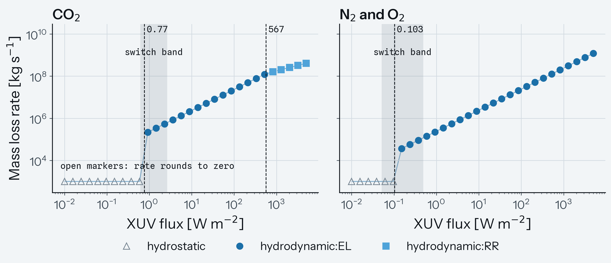
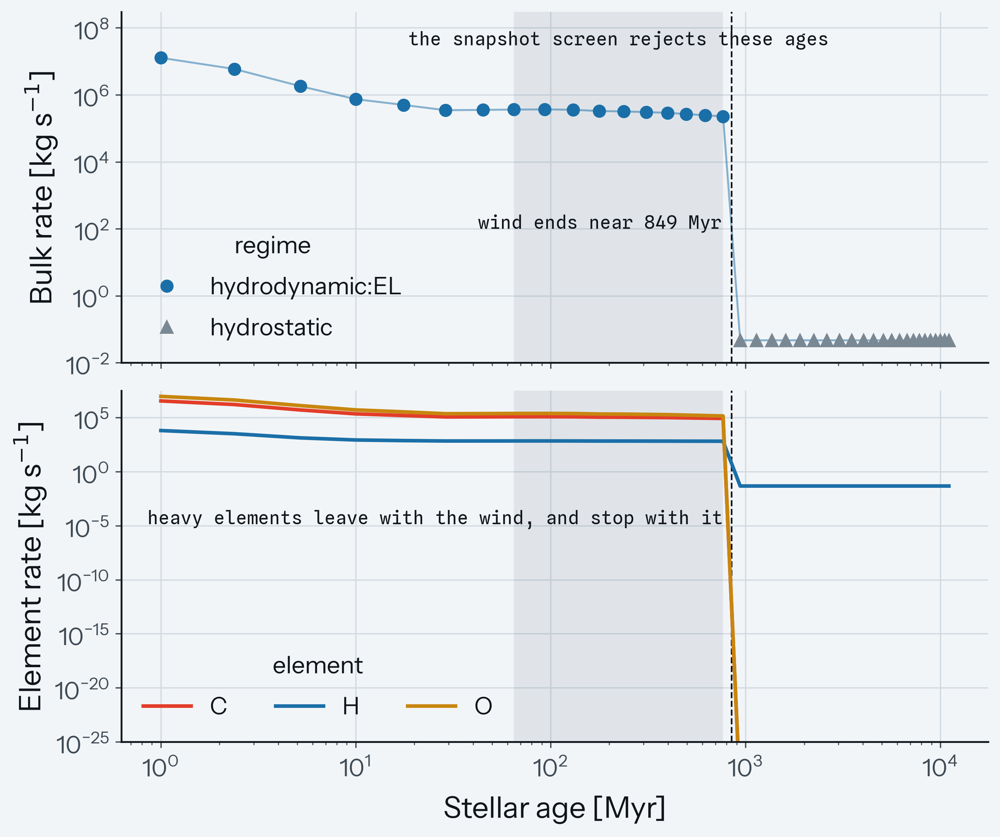

# Dispatching an escape regime

The [first run](first_run.md) applied one prescription unconditionally: scalars in, an energy-limited rate out. This tutorial uses the full framework instead. You hand `zephyrus.dispatch` one planetary state, it decides which escape physics that state is in, and it returns the rate that physics gives, the per-species split, flags, and the diagnostics that say how close the state sat to each regime boundary.

By the end you will have crossed two regime boundaries on the same planet, produced both figures below, read a diagnostics container field by field, measured how far a boundary moves across the width of its own criterion, and dispatched one atmosphere along a stellar XUV history.

If you have not installed ZEPHYRUS yet, follow the [installation guide](../How-to/installation.md) and run `mors download all` for the stellar tracks. The [escape regimes](../Explanations/regimes.md) page defines the physics behind every step here; this page is about driving it.

!!! info "What you'll do"
    - Build a planetary state: scalars plus an atmosphere profile
    - Read one verdict field by field, and check the per-species sum
    - Sweep the XUV flux until the regime label changes, twice
    - Meet the boil-off and overflow labels
    - Read the diagnostics container and learn which entries to look at first
    - Move a boundary with each of the four settings that move one
    - Dispatch a frozen atmosphere along a stellar history

---

## The full script

The complete example is `examples/demo_dispatcher/demo_dispatcher.py`. It writes two figures, so create the output directory first:

```sh
mkdir -p output
python examples/demo_dispatcher/demo_dispatcher.py
```

It prints a table per step and runs in a few seconds, most of which is the boundary bisections.

Every snippet below runs on its own, in order, after this one import, from a session started at the repository root so that `examples` is importable. The example keeps each step in its own function, so you can reuse the pieces one at a time rather than running the whole script:

```python
import numpy as np

from zephyrus.dispatcher import DispatchSettings, dispatch

# build_state assembles the state of step 1, boundary_flux and
# boundary_band bisect a label change in flux, and stellar_track
# dispatches one atmosphere along a MORS history.
from examples.demo_dispatcher.demo_dispatcher import (
    boundary_band,
    boundary_flux,
    build_state,
    stellar_track,
)
```

---

## Step 1: build a state

The energy-limited entry point takes scalars. The framework needs the atmospheric structure as well, because the quantities that decide the regime are properties of the structure and not of the surface: the pressure level where XUV photons are absorbed and the wind is launched, the level where the gas stops colliding often enough to behave as a fluid, and the exobase where individual particles start escaping ballistically.

So a state is scalars plus a `profiles.Profile`. Here it is in full, which is what `build_state` assembles for you in every later step:

```python
import math

from zephyrus.constants import au2m
from zephyrus.dispatcher import DispatchSettings, EscapeInputs, dispatch
from zephyrus.planets_parameters import Me, Me_atm, Ms, Re
from zephyrus.profiles import isothermal_profile

SIGMA_SB = 5.670374419e-8      # Stefan-Boltzmann constant       [W m-2 K-4]
L_SUN = 3.828e26               # solar luminosity                [W]

M_p = 1.0 * Me                 # planet mass                     [kg]
R_p = 1.0 * Re                 # planet radius                   [m]
a = 0.0775 * au2m              # semi-major axis                 [m]
composition = {'CO2': 1.0}     # mole fractions at every level

# Equilibrium temperature and bolometric flux from the orbit, zero albedo
# and full redistribution, so the three stay mutually consistent.
T_eq = (L_SUN / (16.0 * math.pi * SIGMA_SB * a**2)) ** 0.25      # [K]
F_bol = L_SUN / (4.0 * math.pi * a**2)                           # [W m-2]

# One Earth atmosphere, split over elements by mass: the screens and the
# unfractionated split are the only consumers.
reservoirs = {'C': 0.2729 * Me_atm, 'O': 0.7271 * Me_atm}        # [kg]
age = 1.0e8 * 3.15576e7        # snapshot age, 100 Myr           [s]

profile = isothermal_profile(M_p, R_p, T_eq, composition, 1.0e7, 1.0e-5)

state = EscapeInputs(
    M_p=M_p,
    R_p=R_p,
    M_star=1.0 * Ms,           # stellar mass                    [kg]
    a=a,
    e=0.0,                     # eccentricity
    T_eq=T_eq,
    F_xuv=10.0,                # XUV flux at the planet          [W m-2]
    F_bol=F_bol,
    F_int=1.0,                 # interior heat flux              [W m-2]
    kappa_photo=0.01,          # photospheric opacity            [m2 kg-1]
    profile=profile,
    settings=DispatchSettings(),
    age=age,                   # optional, for the consistency screen
    reservoirs=reservoirs,     # optional, element inventories
)

print(f'T_eq   = {T_eq:.1f} K')
print(f'F_bol  = {F_bol:.4g} W m-2')
print(f'levels = {profile.p.size}, {profile.p[0]:.3g} to {profile.p[-1]:.3g} Pa')
print(f'radius = {profile.r[0] / Re:.3f} to {profile.r[-1] / Re:.3f} Earth radii')
print(dispatch(state).regime)
```

Output:

```text
T_eq   = 999.8 K
F_bol  = 2.266e+05 W m-2
levels = 120, 1e+07 to 1e-05 Pa
radius = 1.000 to 1.091 Earth radii
hydrodynamic:EL
```

In a coupled run the atmosphere module supplies the profile. Standalone, `isothermal_profile` integrates a hydrostatic isothermal structure of fixed composition from the surface pressure to the top pressure, which is enough to exercise every branch: 120 levels here, spanning 100 bar to 0.1 nanobar and reaching 1.09 planetary radii. Four of those choices change results rather than just labels:

- The top pressure, $10^{-5}$ Pa or 0.1 nanobar. The XUV wind launches near a nanobar, so a profile that stops deeper than that cannot reach its own wind base and the base clamps to the profile top instead, flagged. Setting the top below a nanobar keeps the clamp out of the way.
- The photospheric opacity, 0.01 m² kg⁻¹ or about 0.1 cm² g⁻¹. The boil-off rate scales as its inverse, so it matters whenever the boil-off branch is in play.
- The orbit, 0.0775 au around a solar-luminosity star, which puts the equilibrium temperature at 1000 K. Deriving $T_\mathrm{eq}$ and $F_\mathrm{bol}$ from the orbit rather than setting all three by hand keeps the state self-consistent.
- The interior heat flux, 1 W m⁻². It sets the luminosity cap on the boil-off residual and nothing else, so it only matters near that branch.

The optional fields are worth setting even when you do not need them: `age` and `reservoirs` are what let the diagnostics tell you whether a rate is consistent with the state having survived, which is step 5.

!!! warning "SI at every boundary"
    Every input is SI: kilograms, meters, seconds, kelvin, W m⁻², m² kg⁻¹. MORS returns cgs luminosities, so the flux conversions in step 7 are explicit.

---

## Step 2: one call, one verdict

Dispatch a carbon dioxide planet of one Earth mass and one Earth radius at 10 W m⁻²:

```python
result = dispatch(build_state('CO2', 1.0, 1.0, 10.0))

print(result.regime)
print(result.mdot)
print(result.per_species)
print(sum(result.per_species.values()) - result.mdot)
print(result.flags)
print(sorted(result.diagnostics))
```

Output:

```text
hydrodynamic:EL
2347722.550685174
{'C': 660973.0964302735, 'O': 1686749.4542549003}
0.0
{}
['base_level', 'bolometric', 'closure', 'documentation', 'erkaev_tc_K',
 'fluid_check', 'guo_triple', 'hydrodynamic', 'hydrostatic', 'johnson_q',
 'knudsen', 'lambda_gate', 'potential_screens', 'rate_floor', 'roche',
 'self_consistency', 'tang_timescale', 'thermostat']
```

Five fields, and each one guarantees something. `regime` is one of five labels. `mdot` is a non-negative bulk rate in kg s⁻¹, here $2.35 \times 10^{6}$ kg s⁻¹, or $7.4 \times 10^{13}$ kg yr⁻¹. `per_species` gives element rates that sum to `mdot` at machine precision, which is what a coupled run relies on when it debits element inventories, and which is worth asserting in your own code. `flags` records every clamp, fallback, and screen that fired; an empty dictionary means nothing needed reporting. `diagnostics` is the container of step 5.

Every physically posed state returns a result. Exceptions are reserved for malformed input, so a `ValueError` from `dispatch` means the state itself is wrong (a negative mass, an eccentricity of 1, a profile whose pressure does not decrease outward), not that the physics failed.

---

## Step 3: cross a boundary

The interesting thing about a dispatcher is where it changes its mind. Sweep the XUV flux on a fixed planet and the label moves, because the flux at a fixed orbit stands in for stellar age: a young star delivers orders of magnitude more XUV than the same star does later.

```python
for f_xuv in np.logspace(-2, np.log10(5.0e3), 30)[::3]:
    out = dispatch(build_state('CO2', 1.0, 1.0, float(f_xuv)))
    kn = out.diagnostics['knudsen']
    print(f'{f_xuv:9.3g}  {out.regime:<17} {out.mdot:11.3e} '
          f'{kn["kn_sc"]:9.3g}  {kn["counterfactual_labels"]}')
```

Output:

```text
     0.01  hydrostatic        4.989e-123   4.5e+18  {0.1: 'hydrostatic', 3.0: 'hydrostatic'}
   0.0389  hydrostatic        4.989e-123  2.28e+18  {0.1: 'hydrostatic', 3.0: 'hydrostatic'}
    0.151  hydrostatic        4.989e-123  3.06e+10  {0.1: 'hydrostatic', 3.0: 'hydrostatic'}
    0.587  hydrostatic        4.989e-123      3.92  {0.1: 'hydrostatic', 3.0: 'hydrostatic'}
     2.28  hydrodynamic:EL     5.356e+05     0.118  {0.1: 'hydrostatic', 3.0: 'hydrodynamic'}
     8.87  hydrodynamic:EL     2.082e+06     0.033  {0.1: 'hydrodynamic', 3.0: 'hydrodynamic'}
     34.5  hydrodynamic:EL     8.090e+06    0.0127  {0.1: 'hydrodynamic', 3.0: 'hydrodynamic'}
      134  hydrodynamic:EL     3.144e+07   0.00558  {0.1: 'hydrodynamic', 3.0: 'hydrodynamic'}
      520  hydrodynamic:EL     1.222e+08   0.00265  {0.1: 'hydrodynamic', 3.0: 'hydrodynamic'}
 2.02e+03  hydrodynamic:RR     2.572e+08   0.00131  {0.1: 'hydrodynamic', 3.0: 'hydrodynamic'}
```

Two labels changed in that sweep. Locate each one by bisection rather than by eye:

```python
print(boundary_flux('CO2', 0.1, 10.0))
print(boundary_flux('CO2', 100.0, 2000.0))
print(boundary_flux('N2-O2', 0.01, 10.0))
```

Output:

```text
0.7695387060616504
566.3838601554727
0.10311115795045854
```

The first crossing is the collisionality switch. Below 0.77 W m⁻² the heating is too weak to keep the gas collisional where a wind would go sonic, so the sonic-point Knudsen number `kn_sc` exceeds 1 and escape is per-particle from the exobase. Above it a fluid wind exists and the rate is the smaller of the two hydrodynamic limits. The second crossing, at 567 W m⁻², is inside the wind: the recombination-limited rate drops below the energy-limited one and names the label.

The third number is that first crossing for a nitrogen and oxygen atmosphere of the same mass and radius, and it sits a factor 7.5 lower. Composition moves the boundaries, not just the rates: that planet also never reaches the recombination-limited label anywhere in the swept range.



Two things in that figure deserve attention.

**The shaded band.** The collisionality threshold has a default of 1 and a physical range of 0.1 to 3, because kinetic simulations place the fluid-to-kinetic transition near 0.1 when the heating is deposited in a sharp layer and near 1 when it is distributed[^johnson]. That is heating-geometry physics, not a tuning parameter, and it makes the boundary a band: on the carbon dioxide planet the wind sets in anywhere between 0.61 and 2.6 W m⁻², a factor of 4.3, depending on which edge of the criterion you adopt. The dashed line is the default; the band is the honest width. Every verdict reports the label it would have carried at both edges, in `diagnostics['knudsen']['counterfactual_labels']`, so you never have to rerun a sweep to find this out.

**The open markers.** The hydrostatic rates on these two planets are $5.0 \times 10^{-123}$ and $1.5 \times 10^{-71}$ kg s⁻¹. Those are not small rates, they are zero with numerical noise attached: carbon dioxide at one Earth mass sits at an exobase Jeans parameter of 301, and $e^{-301}$ is not a number with physical content. Two yardsticks keep this straight:

- One proton crossing the surface per year, $5.3 \times 10^{-35}$ kg s⁻¹, is the smallest rate that can mean anything. Below it, report no escape. The module computes what the physics gives and leaves the convention to you, but it does hand you the comparison: `diagnostics['rate_floor']['above_floor']` is false on both of these points.
- Above that floor, ask whether the rate matters, by comparing it against the inventory and the age. The diagnostics already do this: `diagnostics['self_consistency']` divides the reservoirs by the rate and compares against the age you supplied.

A rate can clear the floor by a hundred decades and still be irrelevant. A Mars-mass planet losing $2 \times 10^{-9}$ kg s⁻¹ loses 66 grams a year.

---

## Step 4: boil-off and overflow

Two labels do not appear in that sweep, and neither depends on the XUV flux.

An inflated hydrogen envelope flows out on the planet's own thermal energy before stellar XUV matters. The test is the restricted Jeans parameter $\Lambda$, the ratio of gravitational binding to thermal energy at the photospheric level, and the state is labeled `boiloff` while it sits below the threshold:

```python
inflated = dispatch(build_state('H/He', 1.0, 1.5, 10.0))

print(inflated.regime, inflated.mdot)
print(inflated.diagnostics['lambda_gate'])
print(inflated.diagnostics['documentation']['lambda_crit_band'])
print(sorted(inflated.flags))
```

Output:

```text
boiloff 134848975815225.14
11.10021097177663
(15.0, 35.0)
['base_clamp_decades', 'base_clamped']
```

At one Earth mass and 1.5 Earth radii with a hydrogen and helium envelope, $\Lambda = 11.10$, well below the threshold of 20, and the rate is $1.3 \times 10^{14}$ kg s⁻¹ at every flux in the sweep. That planet is not long-lived, which is the point: boil-off is the regime of the first few million years.

The clamp flags are expected here, and harmless: an isothermal hydrogen envelope becomes unbound before it reaches a nanobar, so the profile stops early and the wind base clamps to its top. The boil-off branch launches from the photospheric level, not the wind base, so the clamp does not touch the rate. Note what is absent: the hydrodynamic candidates were computed on this state too, and one of them raised a subcritical-sonic caution, but the dispatched rate is the bolometric one and the flags describe the branch that produced it. Flags tell you what happened; deciding whether it matters is your job, and the [troubleshooting guide](../How-to/troubleshooting.md) is a shortcut for the common cases.

Push the same envelope to three Earth masses and two Earth radii and the flow stops being bound to the planet at all:

```python
puffy = dispatch(build_state('H/He', 3.0, 2.0, 0.1))
roche = puffy.diagnostics['roche']

print(puffy.regime, puffy.mdot)
print(roche['flow_radius'], roche['R_hill_periapsis'], roche['xi_flow'])
print(puffy.flags['roche_subflag'])
```

Output:

```text
roche_overflow 24622841.930601332
189433055.79726917 167277833.86655325 0.8830445835470955
no_transonic
```

The flow radius of the winning branch now exceeds the Hill radius, so the atmosphere spills over the gravitational boundary instead of escaping through a bound outflow, and the label says so. The rate is unchanged by the label: the screen renames a state and never recomputes its rate, so what you get is whatever the winning branch produced, here the luminosity-capped bolometric residual at $2.5 \times 10^{7}$ kg s⁻¹ named in `diagnostics['roche']['rate_branch']`. Read it as a lower limit, because the tidally driven flow a genuinely overflowing planet drives is not modeled.

The subflag is the part worth reading. This atmosphere reaches 0.96 Hill radii, just inside the lobe, and only its sonic surface would sit outside, which is `no_transonic`; an atmosphere whose own extent passes the lobe gets `dynamical` instead. The two are far apart physically, and the same screen catches both, so compare `r_atmosphere` against `R_hill_periapsis` in the same group before you trust the label. On a tightly bound heavy atmosphere the label can fire on geometry alone with no rate behind it; the [troubleshooting guide](../How-to/troubleshooting.md) walks the three cases.

---

## Step 5: read the diagnostics

A call returns seventeen or eighteen diagnostic groups, depending on which branch ran, and none of them gates anything: the dispatch logic never reads them back, and there is no switch to turn them off. The regime boundaries carry real physical uncertainty, and reporting the translation quantities beside every verdict is how the framework handles that instead of hiding it.

The [dispatch results reference](../Reference/results.md) documents every key. What follows is the order to read them in, which is the order the questions occur to you. Every snippet in this step uses the same result:

```python
result = dispatch(build_state('CO2', 1.0, 1.0, 10.0))
```

### Which branch, and how close was the switch?

```python
kn = result.diagnostics['knudsen']
print(kn['kn_sc'], kn['threshold_applied'])
print(kn['counterfactual_labels'])
```

Output:

```text
0.03002758706914175 1.0
{0.1: 'hydrodynamic', 3.0: 'hydrodynamic'}
```

A Knudsen number of 0.03 against a threshold of 1 is a wind by a factor of 30, and the counterfactuals confirm the verdict survives both edges of the band. A value within a factor of a few of the threshold, or counterfactuals that disagree with each other, means the label is a choice and not a measurement.

### What set the rate?

```python
hy = result.diagnostics['hydrodynamic']
print(hy['mdot_el'], hy['mdot_rr'])
print(hy['selection_mechanism'], hy['T_wind'], hy['efficiency'], hy['K_tide'])
```

Output:

```text
2347722.550685174 11475561.253503852
EL-selected 8430.51967382717 0.1 0.9175976086377635
```

Both candidates are always computed, so you can see the margin. `selection_mechanism` says which one won, and takes a third value, `RR-selected:subcritical-floor`, when the sonic radius had to be floored at the wind base. It deliberately does not say why an RR win was small: the minimum can select the recombination-limited rate either because the recombination-limited base ionization sets it or because the wind is throttled between base and sonic point, and calling the second one recombination-limited would be a category error. What separates them is `rr_chain['barometric_factor']`, the fraction of the base density reaching the sonic point, which is 0.0095 here. `T_wind` is the temperature a local heating against cooling balance returned, 8431 K here rather than the canonical $10^{4}$ K, and it feeds the sound speed, the barometric exponent, and the recombination coefficient, so it moves the crossover flux of step 3.

### Could the heating drive the flow at all?

```python
print(result.diagnostics['johnson_q']['q_net_over_qc'])
```

Output:

```text
10.112600626056176
```

The transonic energy criterion[^johnson] compares the absorbed, efficiency-degraded power against the power needed to sustain a transonic outflow. A ratio below 1 says the heating cannot drive the flow sonic no matter what a rate formula returns. At 10.1 there is an order of magnitude in hand.

### How does this verdict translate into other taxonomies?

```python
print(result.diagnostics['guo_triple'])
print(result.diagnostics['potential_screens']['log_minus_phi_cgs'])
print(result.diagnostics['potential_screens']['salz_verdict'])
print(result.diagnostics['erkaev_tc_K'])
```

Output:

```text
{'lambda_exo': 301.102296003742, 'lambda_rp': 330.8696490591677,
 'lambda_star': 303.6051987475083,
 'thresholds': 'thermally driven lambda < ~3; tidal lambda* < 3; XUV lambda* > 6'}
11.795855551916663
wind
4233.123936051893
```

Different papers classify escape with different quantities. Reporting the Jeans-parameter triple, the threshold-potential screens, and the critical exobase temperature beside the label lets a reader who thinks in one taxonomy check the verdict in theirs.

### Is the snapshot self-consistent?

```python
print(result.diagnostics['fluid_check'])
print(result.diagnostics['self_consistency'])
```

Output:

```text
{'levels_checked': 120, 'worst_kn': 0.12382483136593705, 'fluid': True,
 'truncated_at_profile_top': True}
{'evaluated': True, 't_deplete_s': 2193615254279.937, 'age_s': 3155760000000000.0,
 'inconsistent': True}
```

The fluid condition has to hold everywhere below the sonic surface, not only at it, so the check walks the profile levels and reports the worst local Knudsen number, declaring the truncation at the profile top. The consistency screen is the sharp one here: at $2.3 \times 10^{6}$ kg s⁻¹ this planet empties one Earth atmosphere in 70 000 years, against the 100 Myr age supplied with the state. The state is not wrong, but it cannot have persisted, and a static grid point that fails this screen is telling you the grid, not the code, needs a second look.

### Where was the wind launched, and where did the coefficients come from?

```python
print(result.diagnostics['base_level'])
print(result.diagnostics['knudsen']['provenance'])
```

Output:

```text
{'p_Pa': 0.0033116709279622522, 'p_physical_Pa': 0.0033116709279622522,
 'r_m': 6828145.239345033, 'T_K': 999.7834337004138, 'clamp_decades': None}
{'C': 'laricchiuta', 'O': 'laricchiuta'}
```

The base sits where the method asked for it, so nothing clamped. Collision cross sections come from tabulated collision integrals where they exist, a diffusion-coefficient inversion for hydrogen, and a geometric hard sphere as the last resort, whose bias is documented. Which one was used travels with the result, so a rate that rests on the last option says so.

---

## Step 6: turn the knobs

Four settings move a boundary rather than just a rate. All of them are in the [parameter reference](../Reference/parameters.md); what follows is what each one does to the answer.

### The collisionality threshold, across its band

Dispatch the same state at each edge of the criterion, then bisect the boundary itself:

```python
for kn_crit in (0.1, 1.0, 3.0):
    settings = DispatchSettings(kn_crit=kn_crit)
    print(kn_crit, dispatch(build_state('CO2', 1.0, 1.0, 1.0, settings=settings)).regime)

print(boundary_band('CO2'))   # the boundary at kn_crit 3, then at 0.1
```

Output:

```text
0.1 hydrostatic
1.0 hydrodynamic:EL
3.0 hydrodynamic:EL
(0.6118163711150405, 2.63867996005799)
```

At 1 W m⁻² the same planet is hydrostatic under the strict edge of the criterion and a wind under the default. Across the band the boundary itself runs from 0.61 to 2.6 W m⁻², a factor of 4.3, from a criterion whose own range is a factor of 30. That number is a result, not an error bar to hide: quote a regime boundary with it.

### The exobase temperature

The hydrostatic branch prescribes it, default 1000 K, and the Jeans flux depends on it exponentially, so it is the branch's dominant sensitivity. The lesson is sharper on a planet where hydrostatic escape does physical work: a Mars-mass planet whose carbon dioxide carries 1% hydrogen.

```python
for t_exo in (1000.0, 2000.0, 4000.0):
    settings = DispatchSettings(T_exo_value=t_exo)
    out = dispatch(build_state('CO2 + 1% H2', 0.107, 0.53, 0.01, settings=settings))
    print(t_exo, out.regime, out.mdot, out.per_species['H'], out.per_species['C'])
```

Output:

```text
1000.0 hydrostatic 348.0757562039205 348.0757562010821 7.746587977671953e-10
2000.0 hydrostatic 354.3317635509398 354.20199467800103 0.03541670869293938
4000.0 hydrostatic 1556.0942672561685 360.57653737857527 326.2824298111698
```

The sweep starts at the profile's own top temperature, near 1000 K here, because a prescribed value below it would ask for a thermosphere that cools with height, whose exobase is more strongly bound than the level it extends from. That request is floored at the top and flagged rather than refused, since in a coupled run the profile top warms past a fixed prescription over secular time. Over the factor of four above it the bulk rate moves by a factor 4.5 while the carbon rate moves by eleven orders of magnitude. The reason is in the per-species detail:

```python
species = out.diagnostics['hydrostatic']['detail']['species']
print(species['H2']['lambda_exo'])
print(species['H2']['phi_jeans'], species['H2']['phi_diffusion'])
```

Output:

```text
0.28260377845019297
1.450974655098389e+16 260647390967054.03
```

At the 4000 K end of the sweep hydrogen sits at an exobase Jeans parameter of 0.28, with a Jeans flux nearly sixty times the supply diffusion can deliver through the heavy background, so its escape is set by that supply and the exobase temperature barely enters: the hydrogen column of the table above moves by 3.6% across the whole sweep. Carbon and oxygen are Jeans limited and carry the whole exponential, eleven orders of magnitude of it. One case, both halves of the harmonic mean that combines them[^yelle], and a warning against reading a bulk rate as though one mechanism produced it.

### Fractionation

A confirmed wind partitions over species through the closure described on the [fractionation page](../Explanations/fractionation.md), which solves for which species escape and how fast at a given bulk rate. Every other branch splits by reservoir mass fractions:

```python
for fractionate in (True, False):
    settings = DispatchSettings(fractionate=fractionate)
    out = dispatch(build_state('CO2', 1.0, 1.0, 10.0, settings=settings))
    total = sum(out.per_species.values())
    print(fractionate, {el: round(v / total, 4) for el, v in sorted(out.per_species.items())})
```

Output:

```text
True {'C': 0.2815, 'O': 0.7185}
False {'C': 0.2729, 'O': 0.7271}
```

A 3% shift, with the lighter element enriched, which is the right size for a well-coupled heavy wind and a reminder that a per-species output is sometimes a bulk split wearing a per-species shape. Where fractionation is strong, this comparison is the whole story of how the atmospheric mean molecular weight evolves.

### The efficiency

Sweeping the energy-limited efficiency across its literature range moves the rate linearly and can move the sub-label:

```python
for eps in (0.1, 0.3, 0.6):
    out = dispatch(build_state('CO2', 1.0, 1.0, 10.0,
                               settings=DispatchSettings(efficiency=eps)))
    hy = out.diagnostics['hydrodynamic']
    print(eps, out.regime, out.mdot, hy['mdot_el'], hy['mdot_rr'])

fitted = dispatch(build_state('CO2', 1.0, 1.0, 10.0,
                              settings=DispatchSettings(efficiency_mode='caldiroli')))
print(fitted.diagnostics['hydrodynamic']['efficiency'], sorted(fitted.flags))
```

Output:

```text
0.1 hydrodynamic:EL 2347722.550685174 2347722.550685174 11475561.253503852
0.3 hydrodynamic:EL 7043167.652055521 7043167.652055521 11475561.253503852
0.6 hydrodynamic:RR 11475561.253503852 14086335.304111041 11475561.253503852
0.7908366641614278 ['caldiroli_out_of_box']
```

At 0.6 the energy-limited candidate overtakes the recombination-limited one and the label changes without the physics of the wind changing at all: the minimum switched hands, nothing else. The fitted-efficiency option returns 0.791 for this planet with `caldiroli_out_of_box` raised, because a one Earth-mass planet sits below the gravitational potential range the fit was made on[^caldiroli]. That is the guard working. Take the flag seriously rather than the number.

### One more, for evolutionary use

Supply the previous label and a hysteresis window opens around the threshold, so a time-stepping track cannot chatter between branches on numerical noise:

```python
for f_xuv in (0.747, 0.793):
    for previous in (None, 'hydrostatic', 'hydrodynamic:EL'):
        state = build_state('CO2', 1.0, 1.0, f_xuv)
        state.prev_regime = previous
        out = dispatch(state)
        kn = out.diagnostics['knudsen']
        print(f_xuv, previous, out.regime, round(kn['kn_sc'], 3), kn['threshold_applied'])
```

Output:

```text
0.747 None hydrostatic 1.124 1.0
0.747 hydrostatic hydrostatic 1.124 0.6666666666666666
0.747 hydrodynamic:EL hydrodynamic:EL 1.124 1.5
0.793 None hydrodynamic:EL 0.898 1.0
0.793 hydrostatic hydrostatic 0.898 0.6666666666666666
0.793 hydrodynamic:EL hydrodynamic:EL 0.898 1.5
```

Inside the window the previous label wins, in both directions, and the applied threshold in the diagnostics tells you when the memory was in use.

---

## Step 7: dispatch along a stellar history

Nothing so far needed a star with a history. Load one, derive the XUV and bolometric fluxes from its track, and dispatch the same frozen atmosphere at each age. That is what `stellar_track` does, for a one Earth-mass planet at 0.2 au carrying carbon dioxide with 1% hydrogen and an inventory of 100 Earth atmospheres:

```python
rows = stellar_track(n_samples=40)

for row in rows[::6]:
    print(f'{row["age_Myr"]:9.1f} {row["F_xuv"]:8.3g} {row["regime"]:<17} '
          f'{row["mdot"]:11.3e} {row["kn_sc"]:9.3g} {row["inconsistent"]}')
```

Output:

```text
      1.0     58.4 hydrodynamic:EL     1.273e+07   0.00941 False
     45.0     1.62 hydrodynamic:EL     3.542e+05     0.265 False
    310.1      1.4 hydrodynamic:EL     3.045e+05     0.388 True
   1138.9    0.852 hydrostatic         4.682e-02      4.81 False
   3039.5    0.495 hydrostatic         4.682e-02  6.73e+03 False
   6189.6     0.34 hydrostatic         4.682e-02  1.58e+07 False
   9439.6    0.324 hydrostatic         4.682e-02  4.83e+07 False
```

The flux conversion is worth reading in the source: MORS returns X-ray and extreme-ultraviolet luminosities in erg s⁻¹, and the state needs W m⁻² at the planet.

!!! warning "This is a sequence of snapshots, not an evolution"
    The profile does not change along the track. A real planet's structure responds to the loss, to its own cooling, and to the star, so treat what follows as the same atmosphere asked the same question at many stellar ages. The framework is not wired into the coupled loop yet; see [coupling to PROTEUS](../Explanations/proteus.md) for the status.



Four things in that figure are worth more than the rest of this page.

The label belongs to the state, not to the planet. Nothing about the planet changed; the star quieted down, the Knudsen number climbed smoothly through its threshold, and the physics of the loss changed character near 850 Myr.

The rate drops by almost seven orders of magnitude at the crossing, from $2.3 \times 10^{5}$ to $4.7 \times 10^{-2}$ kg s⁻¹. The switch is deliberately sharp, with no blend function between branches, so the size of that jump is a measurement you can quote rather than an artifact a smoothing function hides. It is also the honest scale of the disagreement between the two prescriptions at the same physical state.

What escapes changes with the branch, which is the lower panel. In the wind phase carbon and oxygen leave with the hydrogen; in the exosphere phase hydrogen leaves alone and the heavy elements sit at $10^{-140}$ kg s⁻¹. A planet crossing this boundary stops losing its atmosphere and starts losing only its hydrogen.

The hydrostatic rate is flat, at $4.695 \times 10^{-2}$ kg s⁻¹ for ten billion years, because that branch has no XUV physics in it: a prescribed exobase temperature, a frozen profile, and a diffusion-limited supply that does not know about the star. The flat line is a visible reminder of what the branch does not model. It is also why hydrostatic heavy-element rates carry a lower-limit flag: the nonthermal channels that actually remove heavy species from a real exosphere are absent.

And the consistency screen fires in the middle of the track, not at the ends, which is the shaded span. Between about 40 and 800 Myr the dispatched rate would have emptied the supplied inventory faster than the star aged, so those snapshots are not compatible with their own ages. After the crossing the screen goes quiet again, but read that carefully: the state became consistent because escape effectively stopped, not because the inventory survived.

---

## Things to try

- **Move the planet.** Run the track at 0.1 and at 0.4 au. The crossing age moves; find where the planet never leaves the wind regime within the age of the star.
- **Change the composition at fixed mass and radius.** Add water instead of hydrogen, or drop the hydrogen entirely, and watch both the boundary position and the rate after the crossing respond.
- **Sweep the exobase temperature on a heavy atmosphere.** Confirm for yourself that a pure carbon dioxide planet returns rates far below the floor at every temperature in the range, and that the line between computed and meaningful is where the floor sits.
- **Print the whole container.** `pprint(result.diagnostics)` on one call, and read the groups this page skipped: `bolometric`, `thermostat`, `closure`, and `documentation`, which carries the criterion bands themselves so a stored result describes itself.
- **Break a state on purpose.** Give the profile an increasing pressure or a negative mass and confirm the `ValueError`, so you know what a malformed state looks like as opposed to an extreme one.

## Where to go next

- [Escape regimes](../Explanations/regimes.md): every branch, threshold, and equation behind this page.
- [Dispatch results](../Reference/results.md): every flag and every diagnostics key.
- [Troubleshooting the dispatcher](../How-to/troubleshooting.md): a flag fired, or the answer looks wrong.
- [Model parameters](../Reference/parameters.md): every setting and input, with defaults.
- [Limitations](../Explanations/limitations.md): what none of this models.

---

[^johnson]: Johnson, R. E., Volkov, A. N., & Erwin, J. T. (2013). Molecular-Kinetic Simulations of Escape from the Ex-planet and Exoplanets: Criterion for Transonic Flow. *The Astrophysical Journal Letters, 768*(1), L4. https://doi.org/10.1088/2041-8205/768/1/L4

[^yelle]: Yelle, R. V. (2024). Diffusion limited escape of hydrogen from Mars. *Icarus, 416*, 116099.

[^caldiroli]: Caldiroli, A., Haardt, F., Gallo, E., Spinelli, R., Malsky, I., & Rauscher, E. (2022). Irradiation-driven escape of primordial planetary atmospheres II. Evaporation efficiency of sub-Neptunes through hot Jupiters. *Astronomy & Astrophysics, 663*, A122. https://doi.org/10.1051/0004-6361/202142763
